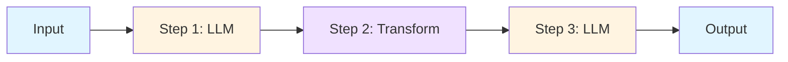
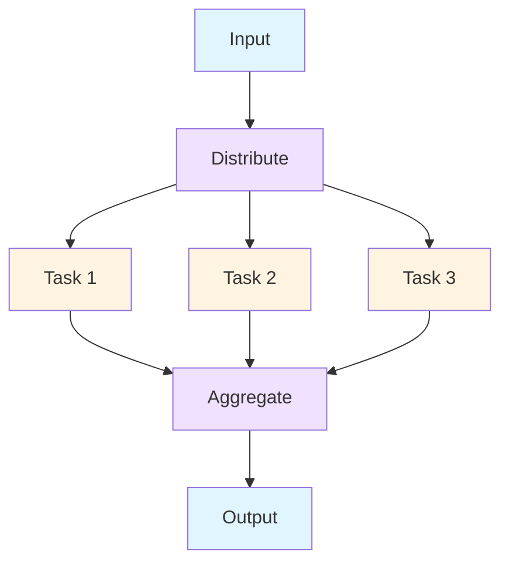
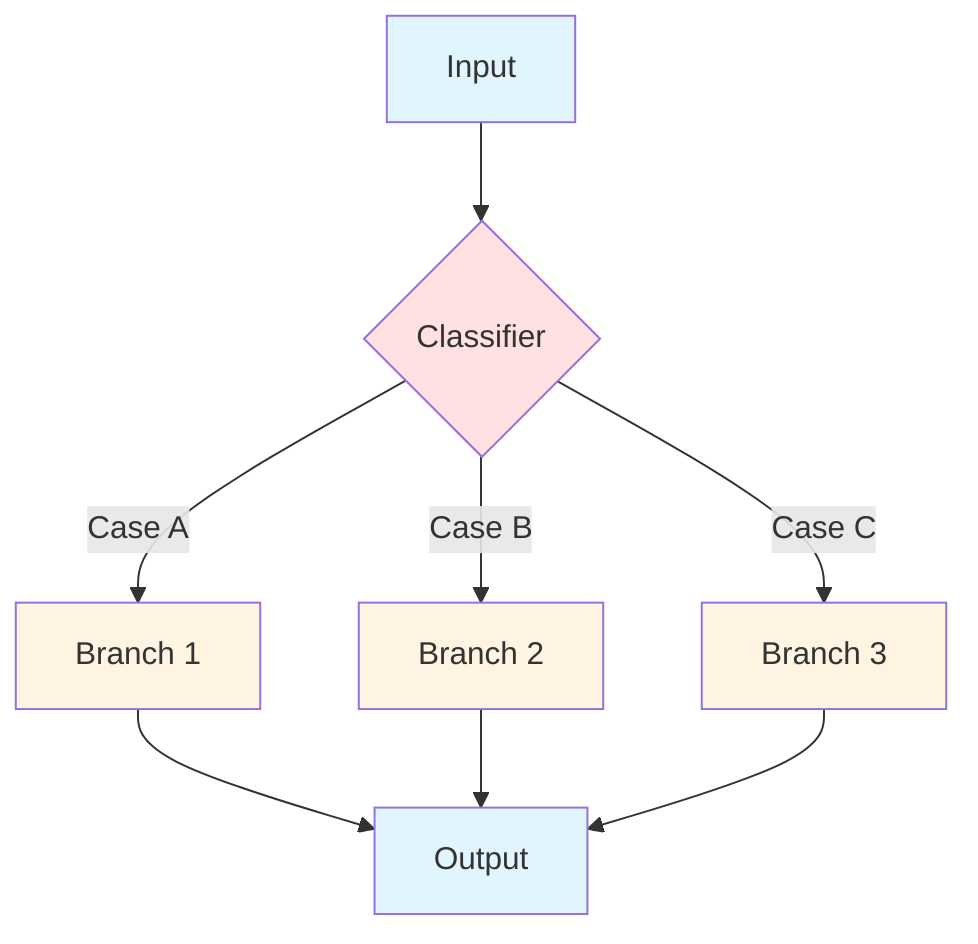
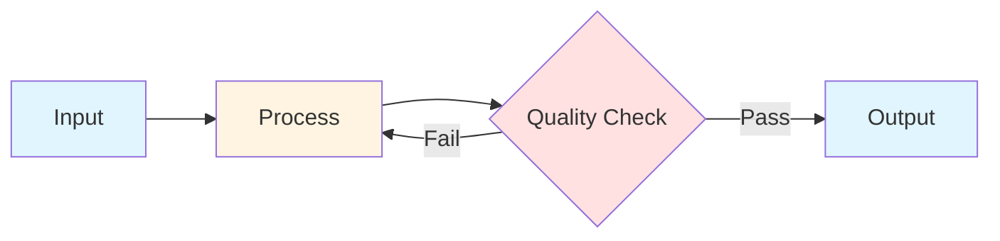
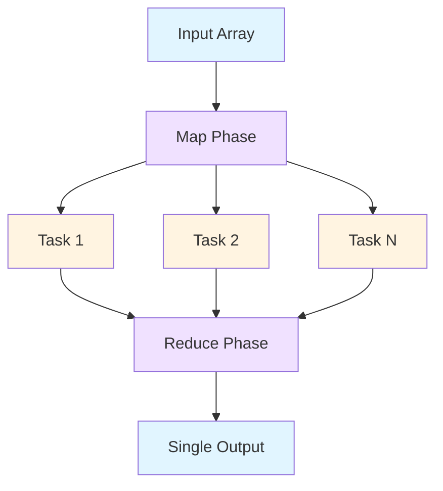
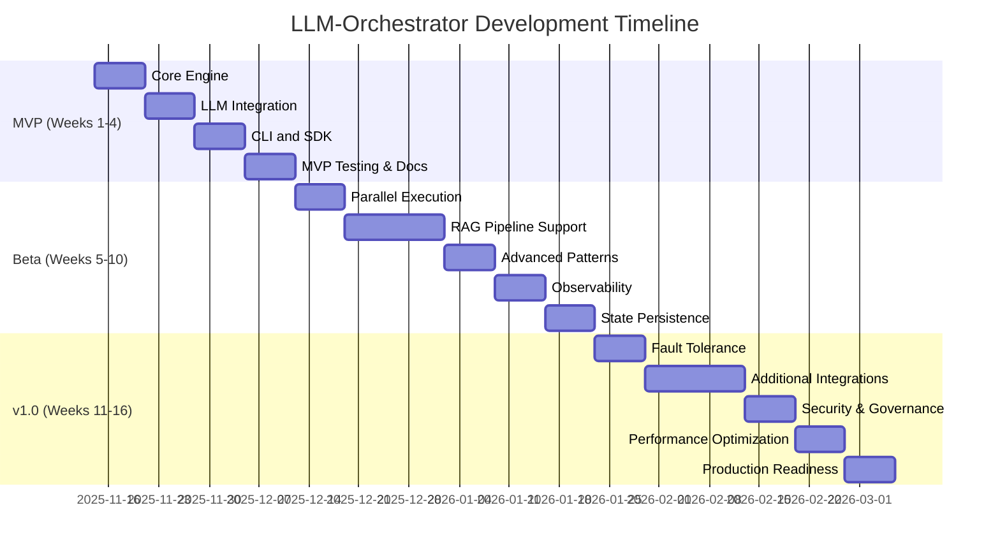

# LLM-Orchestrator Technical Research and Build Plan

**Version:** 1.0.0
**Date:** 2025-11-14
**Framework:** SPARC (Specification, Pseudocode, Architecture, Refinement, Completion)
**Language:** Rust
**Target Ecosystem:** LLM DevOps & AI Orchestration

---

## Executive Summary

The LLM-Orchestrator is a high-performance, Rust-based orchestration framework designed to manage complex workflows involving multiple Large Language Models (LLMs), vector databases, retrieval systems, and AI agents. This document outlines the complete technical specification, architecture, and implementation roadmap following the SPARC methodology.

**Key Objectives:**
- Enable declarative workflow definitions for multi-LLM orchestration
- Provide concurrent execution with intelligent resource management
- Ensure fault-tolerance and graceful degradation
- Integrate seamlessly with the LLM DevOps ecosystem
- Deliver production-grade observability and governance

---

## S - SPECIFICATION

### 1.1 Project Purpose and Scope

**Purpose:**
Build a production-ready orchestration engine that enables developers to:
- Define complex AI workflows declaratively (YAML/JSON/DSL)
- Execute multi-step LLM operations with conditional branching
- Orchestrate parallel LLM requests with automatic batching
- Implement RAG (Retrieval-Augmented Generation) pipelines
- Manage state across distributed AI agent interactions
- Monitor, trace, and debug LLM workflows in production

**Scope:**
- **In Scope:**
  - Workflow engine core (state machine, execution runtime)
  - Multi-LLM provider support (OpenAI, Anthropic, Cohere, local models)
  - Vector database integrations (Pinecone, Weaviate, Qdrant, Chroma)
  - RAG pipeline primitives
  - Async execution with concurrency limits
  - Fault tolerance (retries, circuit breakers, fallbacks)
  - Observability (metrics, traces, logs)
  - SDK/CLI for workflow management
  - REST API for remote orchestration

- **Out of Scope (v1.0):**
  - Fine-tuning orchestration
  - Model training pipelines
  - Data labeling workflows
  - GUI/Web interface (CLI-first approach)

### 1.2 Core Requirements and Capabilities

#### Functional Requirements

**FR-1: Workflow Definition**
- Support declarative workflow syntax (YAML/JSON)
- Enable programmatic workflow construction via Rust SDK
- Provide workflow validation at parse-time
- Support workflow versioning and templates

**FR-2: Execution Engine**
- Execute workflows as DAGs (Directed Acyclic Graphs)
- Support sequential, parallel, and conditional execution
- Enable dynamic workflow branching based on LLM outputs
- Provide context propagation across workflow steps
- Support long-running workflows with state persistence

**FR-3: LLM Integration**
- Abstract multiple LLM providers behind unified interface
- Support streaming and non-streaming responses
- Enable prompt templating with variable substitution
- Provide automatic retry logic with exponential backoff
- Support custom system prompts and temperature settings

**FR-4: RAG Pipeline Support**
- Integrate vector database operations (embed, search, upsert)
- Provide document chunking and embedding utilities
- Support context window management
- Enable hybrid search (vector + keyword)
- Implement relevance scoring and re-ranking

**FR-5: State Management**
- Maintain workflow execution state
- Support distributed state stores (Redis, PostgreSQL)
- Enable checkpointing for long-running workflows
- Provide state rollback capabilities

**FR-6: Concurrency Control**
- Limit concurrent LLM requests (rate limiting)
- Implement token bucket algorithm for API throttling
- Support priority queues for request scheduling
- Enable graceful backpressure handling

#### Non-Functional Requirements

**NFR-1: Performance**
- Execute workflows with <50ms overhead (excluding LLM latency)
- Support 1000+ concurrent workflow executions
- Minimize memory footprint (<100MB base runtime)
- Achieve 99.9% uptime for orchestration engine

**NFR-2: Reliability**
- Implement circuit breakers for failing LLM endpoints
- Provide automatic failover to backup providers
- Ensure at-least-once execution semantics
- Support graceful shutdown with workflow completion

**NFR-3: Observability**
- Export Prometheus metrics for all operations
- Generate OpenTelemetry traces for distributed workflows
- Provide structured logging with correlation IDs
- Enable real-time workflow monitoring dashboards

**NFR-4: Security**
- Store API keys in secure vaults (HashiCorp Vault, AWS Secrets Manager)
- Support RBAC for workflow execution
- Encrypt sensitive data in transit and at rest
- Audit all workflow executions

**NFR-5: Scalability**
- Support horizontal scaling via stateless workers
- Enable sharding for high-volume workloads
- Provide auto-scaling based on queue depth

### 1.3 Integration Requirements with LLM DevOps Ecosystem

**External Systems:**
1. **LLM Providers:**
   - OpenAI (GPT-4, GPT-3.5)
   - Anthropic (Claude 3.5 Sonnet, Opus, Haiku)
   - Cohere (Command, Embed)
   - Local models (Ollama, llama.cpp, vLLM)

2. **Vector Databases:**
   - Pinecone
   - Weaviate
   - Qdrant
   - Chroma
   - Milvus

3. **Message Queues:**
   - Redis Streams
   - Apache Kafka
   - RabbitMQ

4. **Observability Platforms:**
   - Prometheus + Grafana
   - Jaeger / Tempo (tracing)
   - ELK / Loki (logging)
   - Datadog / New Relic

5. **State Stores:**
   - PostgreSQL
   - Redis
   - etcd

### 1.4 Success Criteria

**MVP Success Criteria:**
- Execute basic sequential LLM workflow (3+ steps)
- Support 2+ LLM providers (OpenAI, Anthropic)
- Implement retry logic with exponential backoff
- Provide basic observability (logs + metrics)
- Document API and provide 5+ example workflows

**Beta Success Criteria:**
- Execute complex DAG workflows with branching
- Support parallel execution (10+ concurrent tasks)
- Integrate 2+ vector databases
- Implement circuit breakers and fallbacks
- Achieve <100ms orchestration overhead
- Provide comprehensive test suite (80%+ coverage)

**v1.0 Success Criteria:**
- Production-ready with 99.9% uptime SLA
- Support 5+ LLM providers and 3+ vector databases
- Handle 1000+ concurrent workflow executions
- Complete OpenTelemetry instrumentation
- Published crates.io package with documentation
- Community-validated example projects

---

## P - PSEUDOCODE

### 2.1 Workflow Definition Examples

#### Example 1: Simple Sequential Workflow (YAML)

```yaml
name: "sentiment-analysis-pipeline"
version: "1.0"
description: "Analyze sentiment and generate response"

steps:
  - id: "extract_sentiment"
    type: "llm"
    provider: "openai"
    model: "gpt-4"
    prompt: |
      Analyze the sentiment of the following text:
      {{ input.text }}

      Return only: positive, negative, or neutral
    output: "sentiment"

  - id: "generate_response"
    type: "llm"
    provider: "anthropic"
    model: "claude-3-5-sonnet-20241022"
    prompt: |
      The user's message has {{ sentiment }} sentiment.
      Generate an empathetic response to:
      {{ input.text }}
    output: "response"

  - id: "log_result"
    type: "action"
    action: "log"
    message: "Sentiment: {{ sentiment }}, Response: {{ response }}"
```

#### Example 2: Parallel RAG Pipeline (YAML)

```yaml
name: "parallel-rag-search"
version: "1.0"

steps:
  - id: "embed_query"
    type: "embed"
    provider: "openai"
    model: "text-embedding-3-small"
    input: "{{ query }}"
    output: "query_embedding"

  - id: "parallel_search"
    type: "parallel"
    tasks:
      - id: "search_docs"
        type: "vector_search"
        database: "pinecone"
        index: "documentation"
        query: "{{ query_embedding }}"
        top_k: 5
        output: "doc_results"

      - id: "search_code"
        type: "vector_search"
        database: "pinecone"
        index: "codebase"
        query: "{{ query_embedding }}"
        top_k: 3
        output: "code_results"

  - id: "merge_context"
    type: "transform"
    function: "concat"
    inputs: ["{{ doc_results }}", "{{ code_results }}"]
    output: "combined_context"

  - id: "generate_answer"
    type: "llm"
    provider: "anthropic"
    model: "claude-3-5-sonnet-20241022"
    prompt: |
      Context:
      {{ combined_context }}

      Question: {{ query }}

      Provide a detailed answer using the context above.
    output: "answer"
```

#### Example 3: Conditional Branching Workflow (YAML)

```yaml
name: "content-moderation-router"
version: "1.0"

steps:
  - id: "moderate_content"
    type: "llm"
    provider: "openai"
    model: "gpt-4"
    prompt: |
      Classify this content as: safe, review, or block
      Content: {{ input.content }}
    output: "moderation_result"

  - id: "route_based_on_moderation"
    type: "branch"
    condition: "{{ moderation_result }}"
    branches:
      safe:
        - id: "auto_publish"
          type: "action"
          action: "publish"
          content: "{{ input.content }}"

      review:
        - id: "flag_for_review"
          type: "action"
          action: "queue_review"
          content: "{{ input.content }}"
          priority: "medium"

      block:
        - id: "generate_explanation"
          type: "llm"
          provider: "anthropic"
          model: "claude-3-5-haiku-20241022"
          prompt: |
            Generate a polite explanation for why this content was blocked:
            {{ input.content }}
          output: "block_reason"

        - id: "notify_user"
          type: "action"
          action: "send_notification"
          message: "{{ block_reason }}"
```

### 2.2 Execution Flow Logic

#### Core Execution Loop Pseudocode

```rust
// Workflow execution engine pseudocode

struct WorkflowExecutor {
    state: WorkflowState,
    step_registry: StepRegistry,
    context: ExecutionContext,
    concurrency_limiter: Semaphore,
}

impl WorkflowExecutor {
    async fn execute(&mut self, workflow: Workflow) -> Result<WorkflowOutput> {
        // Initialize execution state
        self.state = WorkflowState::new(&workflow);
        self.context.start_time = Instant::now();

        // Build execution DAG
        let dag = build_dag(&workflow)?;
        validate_dag(&dag)?;

        // Execute DAG topologically
        let mut ready_queue = dag.get_root_nodes();
        let mut completed = HashSet::new();
        let mut futures = FuturesUnordered::new();

        while !ready_queue.is_empty() || !futures.is_empty() {
            // Launch ready tasks (respecting concurrency limits)
            while let Some(step_id) = ready_queue.pop() {
                let permit = self.concurrency_limiter.acquire().await?;
                let step = workflow.get_step(&step_id)?;

                let future = self.execute_step(step, permit);
                futures.push(Box::pin(future));
            }

            // Wait for next completion
            if let Some(result) = futures.next().await {
                match result {
                    Ok(step_output) => {
                        // Update context with step output
                        self.context.set_output(&step_output.step_id, step_output.value);
                        completed.insert(step_output.step_id.clone());

                        // Add newly ready steps to queue
                        let newly_ready = dag.get_ready_nodes(&completed);
                        ready_queue.extend(newly_ready);

                        // Emit telemetry
                        emit_step_completed_metric(&step_output);
                    }
                    Err(e) => {
                        // Handle step failure
                        return self.handle_step_failure(e).await;
                    }
                }
            }
        }

        // Return final workflow output
        Ok(WorkflowOutput {
            context: self.context.clone(),
            duration: self.context.start_time.elapsed(),
            steps_executed: completed.len(),
        })
    }

    async fn execute_step(
        &self,
        step: &Step,
        _permit: SemaphorePermit,
    ) -> Result<StepOutput> {
        // Resolve step inputs from context
        let inputs = self.resolve_inputs(&step.inputs)?;

        // Get step executor from registry
        let executor = self.step_registry.get(&step.step_type)?;

        // Execute with retry logic
        let output = retry_with_backoff(
            || executor.execute(inputs.clone()),
            self.config.max_retries,
            self.config.initial_backoff,
        ).await?;

        // Validate output schema
        validate_output(&output, &step.output_schema)?;

        Ok(StepOutput {
            step_id: step.id.clone(),
            value: output,
        })
    }

    async fn handle_step_failure(&mut self, error: Error) -> Result<WorkflowOutput> {
        match &self.config.failure_policy {
            FailurePolicy::Fail => Err(error),
            FailurePolicy::Continue => {
                // Log error and continue execution
                warn!("Step failed but continuing: {}", error);
                Ok(self.create_partial_output())
            }
            FailurePolicy::Fallback(fallback_workflow) => {
                // Execute fallback workflow
                self.execute(fallback_workflow.clone()).await
            }
        }
    }
}
```

### 2.3 State Transition Pseudocode

```rust
// Workflow state machine pseudocode

enum WorkflowStatus {
    Pending,
    Running,
    Paused,
    Completed,
    Failed,
    Cancelled,
}

struct WorkflowState {
    id: Uuid,
    status: WorkflowStatus,
    started_at: Option<DateTime<Utc>>,
    completed_at: Option<DateTime<Utc>>,
    current_step: Option<String>,
    context: Context,
    checkpoints: Vec<Checkpoint>,
}

impl WorkflowState {
    fn transition(&mut self, event: StateEvent) -> Result<()> {
        match (&self.status, event) {
            // Valid transitions
            (WorkflowStatus::Pending, StateEvent::Start) => {
                self.status = WorkflowStatus::Running;
                self.started_at = Some(Utc::now());
                Ok(())
            }

            (WorkflowStatus::Running, StateEvent::Pause) => {
                self.status = WorkflowStatus::Paused;
                self.create_checkpoint()?;
                Ok(())
            }

            (WorkflowStatus::Paused, StateEvent::Resume) => {
                self.status = WorkflowStatus::Running;
                self.restore_from_checkpoint()?;
                Ok(())
            }

            (WorkflowStatus::Running, StateEvent::Complete) => {
                self.status = WorkflowStatus::Completed;
                self.completed_at = Some(Utc::now());
                Ok(())
            }

            (WorkflowStatus::Running, StateEvent::Fail(error)) => {
                self.status = WorkflowStatus::Failed;
                self.completed_at = Some(Utc::now());
                Err(error)
            }

            (_, StateEvent::Cancel) => {
                self.status = WorkflowStatus::Cancelled;
                self.completed_at = Some(Utc::now());
                Ok(())
            }

            // Invalid transitions
            _ => Err(Error::InvalidStateTransition),
        }
    }

    fn create_checkpoint(&mut self) -> Result<()> {
        let checkpoint = Checkpoint {
            timestamp: Utc::now(),
            step_id: self.current_step.clone(),
            context: self.context.clone(),
        };

        // Persist to state store
        self.checkpoints.push(checkpoint.clone());
        persist_checkpoint(&self.id, &checkpoint)?;

        Ok(())
    }

    fn restore_from_checkpoint(&mut self) -> Result<()> {
        let checkpoint = self.checkpoints.last()
            .ok_or(Error::NoCheckpointFound)?;

        self.current_step = checkpoint.step_id.clone();
        self.context = checkpoint.context.clone();

        Ok(())
    }
}
```

### 2.4 API/SDK Usage Patterns

#### Rust SDK Usage Example

```rust
use llm_orchestrator::{
    Workflow, WorkflowBuilder, LLMProvider, VectorDB,
    RetryPolicy, CircuitBreakerConfig,
};

#[tokio::main]
async fn main() -> Result<()> {
    // Initialize orchestrator with configuration
    let orchestrator = Orchestrator::builder()
        .with_llm_provider(LLMProvider::OpenAI {
            api_key: env::var("OPENAI_API_KEY")?,
            max_retries: 3,
        })
        .with_llm_provider(LLMProvider::Anthropic {
            api_key: env::var("ANTHROPIC_API_KEY")?,
            max_retries: 3,
        })
        .with_vector_db(VectorDB::Pinecone {
            api_key: env::var("PINECONE_API_KEY")?,
            environment: "us-west1-gcp",
        })
        .with_retry_policy(RetryPolicy::ExponentialBackoff {
            initial_delay: Duration::from_millis(100),
            max_delay: Duration::from_secs(30),
            multiplier: 2.0,
        })
        .with_circuit_breaker(CircuitBreakerConfig {
            failure_threshold: 5,
            timeout: Duration::from_secs(30),
            half_open_timeout: Duration::from_secs(60),
        })
        .with_concurrency_limit(50)
        .build()?;

    // Define workflow programmatically
    let workflow = WorkflowBuilder::new("rag-qa-pipeline")
        .description("RAG-powered Q&A system")
        .step(
            Step::embed("embed_query")
                .provider("openai")
                .model("text-embedding-3-small")
                .input_from("{{ query }}")
                .output_to("query_embedding")
        )
        .step(
            Step::vector_search("search_docs")
                .database("pinecone")
                .index("knowledge_base")
                .query_from("{{ query_embedding }}")
                .top_k(5)
                .output_to("search_results")
        )
        .step(
            Step::llm("generate_answer")
                .provider("anthropic")
                .model("claude-3-5-sonnet-20241022")
                .prompt(r#"
                    Context: {{ search_results }}
                    Question: {{ query }}
                    Provide a detailed answer.
                "#)
                .temperature(0.7)
                .max_tokens(1000)
                .output_to("answer")
        )
        .build()?;

    // Execute workflow with input
    let input = json!({
        "query": "What are the key features of Rust's ownership system?"
    });

    let result = orchestrator.execute(&workflow, input).await?;

    println!("Answer: {}", result.get("answer")?);
    println!("Execution time: {:?}", result.duration);

    Ok(())
}
```

#### CLI Usage Example

```bash
# Initialize new workflow project
llm-orchestrator init my-rag-pipeline

# Validate workflow definition
llm-orchestrator validate workflows/sentiment-analysis.yaml

# Execute workflow with input
llm-orchestrator run workflows/sentiment-analysis.yaml \
  --input '{"text": "This product is amazing!"}' \
  --output output.json

# Execute with environment variables
llm-orchestrator run workflows/rag-search.yaml \
  --input-file query.json \
  --env-file .env.production \
  --trace

# Monitor running workflow
llm-orchestrator status <workflow-id>

# List all workflow executions
llm-orchestrator list --status running --limit 10

# Export metrics
llm-orchestrator metrics --format prometheus > metrics.txt
```

---

## A - ARCHITECTURE

### 3.1 System Component Breakdown

```
┌─────────────────────────────────────────────────────────────────┐
│                         LLM Orchestrator                         │
└─────────────────────────────────────────────────────────────────┘

┌─────────────────────────────────────────────────────────────────┐
│                        Interface Layer                           │
├─────────────────┬─────────────────┬──────────────────┬──────────┤
│   CLI Client    │   Rust SDK      │   REST API       │  gRPC API│
└─────────────────┴─────────────────┴──────────────────┴──────────┘

┌─────────────────────────────────────────────────────────────────┐
│                      Orchestration Core                          │
├─────────────────┬─────────────────┬──────────────────┬──────────┤
│ Workflow Engine │ State Machine   │ Context Manager  │ Scheduler│
├─────────────────┼─────────────────┼──────────────────┼──────────┤
│ DAG Builder     │ Validator       │ Template Engine  │ Router   │
└─────────────────┴─────────────────┴──────────────────┴──────────┘

┌─────────────────────────────────────────────────────────────────┐
│                       Execution Layer                            │
├──────────────┬──────────────┬──────────────┬───────────────────┤
│ Step Executor│ Task Spawner │ Result Merger│ Error Handler     │
└──────────────┴──────────────┴──────────────┴───────────────────┘

┌─────────────────────────────────────────────────────────────────┐
│                    Integration Layer                             │
├──────────────┬──────────────┬──────────────┬───────────────────┤
│ LLM Adapters │ Vector DBs   │ Embeddings   │ Custom Actions    │
│ - OpenAI     │ - Pinecone   │ - OpenAI     │ - HTTP Request    │
│ - Anthropic  │ - Weaviate   │ - Cohere     │ - DB Query        │
│ - Cohere     │ - Qdrant     │ - Local      │ - File Ops        │
│ - Local      │ - Chroma     │              │ - Webhooks        │
└──────────────┴──────────────┴──────────────┴───────────────────┘

┌─────────────────────────────────────────────────────────────────┐
│                   Reliability Layer                              │
├──────────────┬──────────────┬──────────────┬───────────────────┤
│ Retry Logic  │Circuit Breaker│ Rate Limiter│ Timeout Manager   │
└──────────────┴──────────────┴──────────────┴───────────────────┘

┌─────────────────────────────────────────────────────────────────┐
│                   Observability Layer                            │
├──────────────┬──────────────┬──────────────┬───────────────────┤
│ Metrics      │ Tracing      │ Logging      │ Health Checks     │
│ (Prometheus) │ (OTel)       │ (Structured) │                   │
└──────────────┴──────────────┴──────────────┴───────────────────┘

┌─────────────────────────────────────────────────────────────────┐
│                      Storage Layer                               │
├──────────────┬──────────────┬──────────────┬───────────────────┤
│ State Store  │ Cache        │ Queue        │ Config Store      │
│ (Postgres)   │ (Redis)      │ (Redis)      │ (File/Consul)     │
└──────────────┴──────────────┴──────────────┴───────────────────┘
```

### 3.2 Orchestration Pattern Designs

#### Pattern 1: Sequential Pipeline



**Use Cases:**
- Multi-stage text processing
- Chain-of-thought reasoning
- Sequential data enrichment

**Implementation:**
- Simple task queue
- Synchronous step execution
- Context passed via channels

---

#### Pattern 2: Fan-Out/Fan-In (Parallel Aggregation)



**Use Cases:**
- Multiple LLM provider comparison
- Parallel RAG searches across databases
- Batch processing with aggregation

**Implementation:**
- Tokio `FuturesUnordered` for parallel execution
- Semaphore for concurrency control
- Join handles for result collection

---

#### Pattern 3: Conditional Branching (Router)



**Use Cases:**
- Content moderation with routing
- Intent-based agent selection
- A/B testing workflows

**Implementation:**
- Pattern matching on classifier output
- Dynamic DAG construction
- Conditional step skipping

---

#### Pattern 4: Iterative Refinement (Loop)



**Use Cases:**
- Self-critique and improvement
- Iterative summarization
- Quality assurance loops

**Implementation:**
- Loop counter to prevent infinite loops
- Convergence criteria evaluation
- State persistence across iterations

---

#### Pattern 5: Map-Reduce



**Use Cases:**
- Batch document summarization
- Distributed sentiment analysis
- Large-scale embeddings generation

**Implementation:**
- Stream-based processing for large inputs
- Chunked execution with backpressure
- Result streaming for incremental output

### 3.3 Concurrency and Fault-Tolerance Mechanisms

#### Concurrency Control Architecture

```rust
// Concurrency limiter with priority queues

pub struct ConcurrencyController {
    // Global semaphore for max concurrent tasks
    global_semaphore: Arc<Semaphore>,

    // Per-provider rate limiters
    provider_limiters: HashMap<String, RateLimiter>,

    // Priority queue for task scheduling
    priority_queue: PriorityQueue<Task>,

    // Active task tracker
    active_tasks: DashMap<Uuid, TaskHandle>,
}

impl ConcurrencyController {
    pub async fn acquire_slot(
        &self,
        task: Task,
        priority: Priority,
    ) -> Result<ExecutionPermit> {
        // Check global concurrency limit
        let global_permit = self.global_semaphore.acquire().await?;

        // Check provider-specific rate limit
        let provider = task.get_provider();
        let rate_permit = self.provider_limiters
            .get(&provider)
            .ok_or(Error::UnknownProvider)?
            .acquire()
            .await?;

        // Register active task
        let task_id = Uuid::new_v4();
        self.active_tasks.insert(task_id, TaskHandle {
            task: task.clone(),
            started_at: Instant::now(),
        });

        Ok(ExecutionPermit {
            task_id,
            global_permit,
            rate_permit,
        })
    }

    pub async fn release_slot(&self, permit: ExecutionPermit) {
        self.active_tasks.remove(&permit.task_id);
        // Permits automatically dropped
    }
}
```

#### Fault Tolerance Mechanisms

**1. Retry Logic with Exponential Backoff**

```rust
pub async fn retry_with_backoff<F, T>(
    mut operation: F,
    max_retries: u32,
    initial_delay: Duration,
) -> Result<T>
where
    F: FnMut() -> BoxFuture<'static, Result<T>>,
{
    let mut attempt = 0;
    let mut delay = initial_delay;

    loop {
        match operation().await {
            Ok(result) => return Ok(result),
            Err(e) if attempt < max_retries && e.is_retryable() => {
                warn!("Attempt {} failed: {}. Retrying after {:?}",
                      attempt + 1, e, delay);

                tokio::time::sleep(delay).await;

                attempt += 1;
                delay = min(delay * 2, Duration::from_secs(60));
            }
            Err(e) => return Err(e),
        }
    }
}
```

**2. Circuit Breaker Pattern**

```rust
pub struct CircuitBreaker {
    state: Arc<RwLock<CircuitState>>,
    failure_threshold: u32,
    timeout: Duration,
    half_open_timeout: Duration,
}

enum CircuitState {
    Closed,
    Open { opened_at: Instant },
    HalfOpen,
}

impl CircuitBreaker {
    pub async fn call<F, T>(&self, operation: F) -> Result<T>
    where
        F: FnOnce() -> BoxFuture<'static, Result<T>>,
    {
        // Check circuit state
        let state = self.state.read().await;

        match *state {
            CircuitState::Open { opened_at } => {
                if opened_at.elapsed() > self.half_open_timeout {
                    drop(state);
                    self.transition_to_half_open().await;
                } else {
                    return Err(Error::CircuitOpen);
                }
            }
            _ => {}
        }
        drop(state);

        // Execute operation
        let result = operation().await;

        // Update circuit state based on result
        match result {
            Ok(value) => {
                self.record_success().await;
                Ok(value)
            }
            Err(e) => {
                self.record_failure().await;
                Err(e)
            }
        }
    }

    async fn record_failure(&self) {
        let mut state = self.state.write().await;
        // Increment failure counter and potentially open circuit
        // Implementation details...
    }
}
```

**3. Fallback Strategies**

```rust
pub enum FallbackStrategy {
    // Use backup LLM provider
    AlternativeProvider(String),

    // Return cached result if available
    CachedResponse,

    // Execute simplified workflow
    DegradedMode(Workflow),

    // Return static default
    DefaultValue(Value),
}

pub async fn execute_with_fallback(
    primary: impl Future<Output = Result<T>>,
    fallback: FallbackStrategy,
) -> Result<T> {
    match primary.await {
        Ok(result) => Ok(result),
        Err(e) => {
            warn!("Primary execution failed: {}. Attempting fallback.", e);

            match fallback {
                FallbackStrategy::AlternativeProvider(provider) => {
                    execute_with_provider(provider).await
                }
                FallbackStrategy::CachedResponse => {
                    get_cached_response().await
                }
                FallbackStrategy::DegradedMode(workflow) => {
                    execute_workflow(workflow).await
                }
                FallbackStrategy::DefaultValue(value) => {
                    Ok(value)
                }
            }
        }
    }
}
```

### 3.4 Deployment Architecture

```
┌─────────────────────────────────────────────────────────────┐
│                      Load Balancer                           │
│                    (NGINX / HAProxy)                         │
└─────────────────────────────────────────────────────────────┘
                            │
        ┌───────────────────┼───────────────────┐
        │                   │                   │
        ▼                   ▼                   ▼
┌──────────────┐    ┌──────────────┐    ┌──────────────┐
│ Orchestrator │    │ Orchestrator │    │ Orchestrator │
│   Instance 1 │    │   Instance 2 │    │   Instance N │
│  (Stateless) │    │  (Stateless) │    │  (Stateless) │
└──────────────┘    └──────────────┘    └──────────────┘
        │                   │                   │
        └───────────────────┼───────────────────┘
                            │
        ┌───────────────────┼───────────────────┐
        │                   │                   │
        ▼                   ▼                   ▼
┌──────────────┐    ┌──────────────┐    ┌──────────────┐
│  PostgreSQL  │    │    Redis     │    │  Message     │
│ (State Store)│    │  (Cache/Lock)│    │   Queue      │
└──────────────┘    └──────────────┘    └──────────────┘
```

**Deployment Options:**

1. **Kubernetes Deployment:**
```yaml
apiVersion: apps/v1
kind: Deployment
metadata:
  name: llm-orchestrator
spec:
  replicas: 3
  selector:
    matchLabels:
      app: llm-orchestrator
  template:
    metadata:
      labels:
        app: llm-orchestrator
    spec:
      containers:
      - name: orchestrator
        image: llm-orchestrator:latest
        ports:
        - containerPort: 8080
        env:
        - name: STATE_STORE_URL
          value: "postgresql://postgres:5432/orchestrator"
        - name: REDIS_URL
          value: "redis://redis:6379"
        resources:
          requests:
            memory: "256Mi"
            cpu: "250m"
          limits:
            memory: "1Gi"
            cpu: "1000m"
        livenessProbe:
          httpGet:
            path: /health
            port: 8080
          initialDelaySeconds: 30
          periodSeconds: 10
```

2. **Docker Compose (Development):**
```yaml
version: '3.8'
services:
  orchestrator:
    build: .
    ports:
      - "8080:8080"
    environment:
      - STATE_STORE_URL=postgresql://postgres:5432/orchestrator
      - REDIS_URL=redis://redis:6379
    depends_on:
      - postgres
      - redis

  postgres:
    image: postgres:16
    environment:
      POSTGRES_DB: orchestrator
      POSTGRES_PASSWORD: password
    volumes:
      - postgres_data:/var/lib/postgresql/data

  redis:
    image: redis:7-alpine
    volumes:
      - redis_data:/data

volumes:
  postgres_data:
  redis_data:
```

3. **Standalone Binary:**
```bash
# Single-node deployment with embedded SQLite
llm-orchestrator server \
  --port 8080 \
  --state-store sqlite://./orchestrator.db \
  --workers 10 \
  --config ./config.toml
```

### 3.5 Integration Architecture

#### LLM Provider Integration Interface

```rust
#[async_trait]
pub trait LLMProvider: Send + Sync {
    /// Generate completion from prompt
    async fn complete(&self, request: CompletionRequest) -> Result<CompletionResponse>;

    /// Stream completion tokens
    async fn stream_complete(
        &self,
        request: CompletionRequest,
    ) -> Result<Pin<Box<dyn Stream<Item = Result<StreamChunk>> + Send>>>;

    /// Generate embeddings
    async fn embed(&self, request: EmbedRequest) -> Result<EmbedResponse>;

    /// Check provider health
    async fn health_check(&self) -> Result<HealthStatus>;

    /// Get provider metadata
    fn metadata(&self) -> ProviderMetadata;
}

// Example: OpenAI provider implementation
pub struct OpenAIProvider {
    client: OpenAIClient,
    config: OpenAIConfig,
    rate_limiter: RateLimiter,
}

#[async_trait]
impl LLMProvider for OpenAIProvider {
    async fn complete(&self, request: CompletionRequest) -> Result<CompletionResponse> {
        // Acquire rate limit token
        self.rate_limiter.acquire().await?;

        // Map internal request to OpenAI format
        let openai_request = map_to_openai_request(request)?;

        // Call OpenAI API
        let response = self.client
            .chat()
            .create(openai_request)
            .await
            .map_err(|e| Error::ProviderError(e.to_string()))?;

        // Map response back to internal format
        Ok(map_from_openai_response(response))
    }

    // Additional method implementations...
}
```

#### Vector Database Integration Interface

```rust
#[async_trait]
pub trait VectorDatabase: Send + Sync {
    /// Insert vectors into index
    async fn upsert(&self, request: UpsertRequest) -> Result<UpsertResponse>;

    /// Search for similar vectors
    async fn search(&self, request: SearchRequest) -> Result<SearchResponse>;

    /// Delete vectors by ID
    async fn delete(&self, request: DeleteRequest) -> Result<DeleteResponse>;

    /// Create index
    async fn create_index(&self, config: IndexConfig) -> Result<()>;

    /// Get index stats
    async fn index_stats(&self, index_name: &str) -> Result<IndexStats>;
}

// Example: Pinecone implementation
pub struct PineconeDatabase {
    client: PineconeClient,
    config: PineconeConfig,
}

#[async_trait]
impl VectorDatabase for PineconeDatabase {
    async fn search(&self, request: SearchRequest) -> Result<SearchResponse> {
        let pinecone_request = QueryRequest {
            namespace: request.namespace,
            top_k: request.top_k,
            vector: request.query_vector,
            filter: request.filter.map(|f| map_filter(f)),
            include_metadata: request.include_metadata,
        };

        let response = self.client
            .query(pinecone_request)
            .await
            .map_err(|e| Error::VectorDBError(e.to_string()))?;

        Ok(SearchResponse {
            results: response.matches.into_iter().map(|m| SearchResult {
                id: m.id,
                score: m.score,
                metadata: m.metadata,
            }).collect(),
        })
    }

    // Additional method implementations...
}
```

---

## R - REFINEMENT

### 4.1 Design Trade-offs and Alternatives

#### Trade-off 1: Workflow Definition Language

| Aspect | YAML/JSON | Rust DSL | Custom Language |
|--------|-----------|----------|-----------------|
| **Learning Curve** | Low (familiar format) | Medium (Rust knowledge required) | High (new syntax) |
| **Type Safety** | None (runtime validation) | Full (compile-time) | Partial (depending on implementation) |
| **Flexibility** | Limited to predefined constructs | Full Rust expressiveness | Customizable |
| **IDE Support** | Basic (YAML/JSON tools) | Excellent (rust-analyzer) | Requires custom tooling |
| **Versioning** | Easy (text-based) | Easy (crates) | Medium (custom parser) |
| **Debugging** | Challenging (runtime errors) | Excellent (Rust tooling) | Depends on implementation |

**Decision:** Implement **hybrid approach**
- YAML/JSON for declarative workflows (simple use cases)
- Rust SDK for programmatic workflows (complex logic)
- Compile YAML/JSON to internal AST at runtime

**Rationale:** Maximizes accessibility while enabling power users to leverage Rust's type system.

---

#### Trade-off 2: State Persistence

| Aspect | In-Memory | SQLite | PostgreSQL | Redis |
|--------|-----------|--------|------------|-------|
| **Performance** | Fastest | Fast | Medium | Fast |
| **Durability** | None | Persistent | Persistent | Optional |
| **Scalability** | Single-node only | Single-node | Multi-node | Multi-node |
| **Complexity** | Lowest | Low | Medium | Medium |
| **Query Capabilities** | Limited | SQL | SQL | Limited |
| **Use Case** | Development | Small deployments | Production | Caching |

**Decision:** **Pluggable state store interface** with implementations for:
1. In-memory (development/testing)
2. SQLite (single-node production)
3. PostgreSQL (multi-node production)
4. Redis (distributed with TTL)

**Rationale:** Different deployment scenarios have different requirements.

---

#### Trade-off 3: Concurrency Model

| Model | Pros | Cons |
|-------|------|------|
| **Thread Pool** | Simple, predictable | Limited by thread count, higher memory |
| **Async Tasks (Tokio)** | Highly scalable, low overhead | Complex error handling, backpressure management |
| **Actor Model (Actix)** | Isolated state, fault-tolerant | Message passing overhead, learning curve |
| **Green Threads** | User-space scheduling | Not well-supported in Rust |

**Decision:** **Async tasks with Tokio**
- Best fit for I/O-bound LLM operations
- Industry-standard in Rust ecosystem
- Excellent tooling and community support

**Implementation Details:**
- Use `tokio::spawn` for task spawning
- Semaphores for concurrency limiting
- `FuturesUnordered` for parallel execution
- Channels for inter-task communication

---

#### Trade-off 4: Error Handling Strategy

**Options:**
1. **Result<T, E> propagation** (Rust idiomatic)
2. **Exceptions/Panics** (not Rust-native)
3. **Error accumulation** (collect all errors)
4. **Partial success** (continue on error)

**Decision:** **Hybrid approach**
```rust
pub enum ExecutionResult<T> {
    // All steps succeeded
    Success(T),

    // Some steps failed but execution completed
    PartialSuccess {
        output: T,
        errors: Vec<StepError>,
    },

    // Critical failure, execution halted
    Failure(WorkflowError),
}
```

**Rationale:** Provides flexibility for different failure handling strategies.

### 4.2 Performance Optimization Strategies

#### Strategy 1: Request Batching

**Problem:** Individual LLM requests have high overhead
**Solution:** Batch multiple requests to the same provider

```rust
pub struct RequestBatcher {
    pending: DashMap<String, Vec<PendingRequest>>,
    batch_size: usize,
    batch_timeout: Duration,
}

impl RequestBatcher {
    pub async fn submit(&self, request: CompletionRequest) -> Result<CompletionResponse> {
        let provider = request.provider.clone();

        // Add to pending batch
        let (tx, rx) = oneshot::channel();
        self.pending
            .entry(provider.clone())
            .or_insert_with(Vec::new)
            .push(PendingRequest { request, tx });

        // Trigger batch if size threshold reached
        if self.should_flush(&provider) {
            self.flush_batch(&provider).await?;
        }

        // Wait for response
        rx.await?
    }

    async fn flush_batch(&self, provider: &str) -> Result<()> {
        let mut batch = self.pending
            .get_mut(provider)
            .ok_or(Error::NoBatch)?;

        if batch.is_empty() {
            return Ok(());
        }

        let requests = batch.drain(..).collect::<Vec<_>>();

        // Execute batch request
        let responses = execute_batch_request(requests).await?;

        // Send responses to waiting tasks
        for (pending, response) in requests.into_iter().zip(responses) {
            let _ = pending.tx.send(response);
        }

        Ok(())
    }
}
```

**Expected Improvement:** 30-50% reduction in total request time for batched workloads

---

#### Strategy 2: Response Caching

**Implementation:**
```rust
pub struct ResponseCache {
    cache: Arc<DashMap<CacheKey, CachedResponse>>,
    ttl: Duration,
}

#[derive(Hash, Eq, PartialEq)]
struct CacheKey {
    provider: String,
    model: String,
    prompt_hash: u64,
    parameters: RequestParameters,
}

impl ResponseCache {
    pub async fn get_or_execute<F>(
        &self,
        request: &CompletionRequest,
        executor: F,
    ) -> Result<CompletionResponse>
    where
        F: FnOnce() -> BoxFuture<'static, Result<CompletionResponse>>,
    {
        let key = self.compute_cache_key(request);

        // Check cache
        if let Some(cached) = self.cache.get(&key) {
            if !cached.is_expired() {
                return Ok(cached.response.clone());
            }
        }

        // Execute and cache
        let response = executor().await?;

        self.cache.insert(key, CachedResponse {
            response: response.clone(),
            cached_at: Instant::now(),
        });

        Ok(response)
    }
}
```

**Cache Invalidation Strategy:**
- TTL-based expiration (configurable per workflow)
- LRU eviction for memory management
- Manual invalidation via API

---

#### Strategy 3: Connection Pooling

```rust
pub struct ProviderConnectionPool {
    pools: HashMap<String, Pool<ProviderConnection>>,
    max_connections_per_provider: usize,
}

// Reuse HTTP connections to LLM providers
// Implement using hyper connection pool or reqwest client pool
```

**Expected Improvement:** 20-30% reduction in connection overhead

---

#### Strategy 4: Streaming Response Processing

**Problem:** Waiting for complete LLM response before proceeding
**Solution:** Process streaming tokens as they arrive

```rust
pub async fn stream_and_process(
    request: CompletionRequest,
) -> Result<impl Stream<Item = Result<ProcessedChunk>>> {
    let stream = provider.stream_complete(request).await?;

    stream
        .map(|chunk| {
            // Process chunk immediately
            process_chunk(chunk)
        })
        .buffer_unordered(10) // Process up to 10 chunks in parallel
}
```

**Use Case:** Long-form content generation with incremental processing

### 4.3 Security and Governance Considerations

#### Security Measures

**1. API Key Management**
```rust
pub enum SecretStore {
    Environment,
    File { path: PathBuf, encrypted: bool },
    Vault { url: String, token: String },
    AwsSecretsManager { region: String },
    HashiCorpVault { url: String, token: String },
}

impl SecretStore {
    pub async fn get_secret(&self, key: &str) -> Result<String> {
        match self {
            SecretStore::Vault { url, token } => {
                // Fetch from HashiCorp Vault
                let client = VaultClient::new(url, token)?;
                client.get_secret(key).await
            }
            SecretStore::AwsSecretsManager { region } => {
                // Fetch from AWS Secrets Manager
                let client = aws_sdk_secretsmanager::Client::new(
                    &aws_config::load_from_env().await
                );
                let response = client
                    .get_secret_value()
                    .secret_id(key)
                    .send()
                    .await?;
                Ok(response.secret_string().unwrap().to_string())
            }
            // Other implementations...
        }
    }
}
```

**2. Input Validation and Sanitization**
```rust
pub struct InputValidator {
    max_prompt_length: usize,
    forbidden_patterns: Vec<Regex>,
    required_fields: HashSet<String>,
}

impl InputValidator {
    pub fn validate(&self, input: &Value) -> Result<()> {
        // Validate prompt length
        if let Some(prompt) = input.get("prompt").and_then(|v| v.as_str()) {
            if prompt.len() > self.max_prompt_length {
                return Err(Error::PromptTooLong);
            }
        }

        // Check for injection patterns
        for pattern in &self.forbidden_patterns {
            if pattern.is_match(&input.to_string()) {
                return Err(Error::InvalidInput("Forbidden pattern detected"));
            }
        }

        Ok(())
    }
}
```

**3. Rate Limiting and Abuse Prevention**
```rust
pub struct UserRateLimiter {
    limiters: DashMap<UserId, RateLimiter>,
    global_limit: RateLimiter,
}

impl UserRateLimiter {
    pub async fn check_limit(&self, user_id: &UserId) -> Result<()> {
        // Check global limit
        self.global_limit.acquire().await?;

        // Check per-user limit
        let limiter = self.limiters
            .entry(user_id.clone())
            .or_insert_with(|| RateLimiter::new(100, Duration::from_secs(60)));

        limiter.acquire().await?;

        Ok(())
    }
}
```

**4. Audit Logging**
```rust
pub struct AuditLogger {
    logger: Logger,
    storage: AuditStore,
}

#[derive(Serialize)]
pub struct AuditEvent {
    timestamp: DateTime<Utc>,
    user_id: String,
    workflow_id: String,
    action: String,
    inputs: Option<Value>,
    outputs: Option<Value>,
    metadata: HashMap<String, String>,
}

impl AuditLogger {
    pub async fn log_execution(&self, event: AuditEvent) -> Result<()> {
        // Log to structured logger
        info!(
            user_id = %event.user_id,
            workflow_id = %event.workflow_id,
            action = %event.action,
            "Workflow execution"
        );

        // Persist to audit store
        self.storage.insert(event).await?;

        Ok(())
    }
}
```

#### Governance Framework

**1. Workflow Approval Process**
```rust
pub enum WorkflowStatus {
    Draft,
    PendingApproval,
    Approved,
    Rejected { reason: String },
    Deployed,
    Deprecated,
}

pub struct WorkflowGovernance {
    approval_rules: Vec<ApprovalRule>,
}

pub struct ApprovalRule {
    condition: Box<dyn Fn(&Workflow) -> bool>,
    required_approvers: Vec<String>,
}

impl WorkflowGovernance {
    pub async fn submit_for_approval(&self, workflow: &Workflow) -> Result<()> {
        // Determine required approvers based on rules
        let approvers = self.get_required_approvers(workflow);

        // Create approval request
        let request = ApprovalRequest {
            workflow_id: workflow.id.clone(),
            submitter: workflow.author.clone(),
            required_approvers: approvers,
            status: ApprovalStatus::Pending,
        };

        // Notify approvers
        self.notify_approvers(&request).await?;

        Ok(())
    }
}
```

**2. Cost Tracking and Budgeting**
```rust
pub struct CostTracker {
    usage_store: UsageStore,
}

#[derive(Serialize)]
pub struct UsageRecord {
    timestamp: DateTime<Utc>,
    workflow_id: String,
    user_id: String,
    provider: String,
    model: String,
    tokens_used: u32,
    estimated_cost: f64,
}

impl CostTracker {
    pub async fn track_usage(&self, execution: &WorkflowExecution) -> Result<()> {
        let mut total_cost = 0.0;

        for step in &execution.steps {
            if let Some(tokens) = step.tokens_used {
                let cost = self.calculate_cost(
                    &step.provider,
                    &step.model,
                    tokens,
                );
                total_cost += cost;

                self.usage_store.insert(UsageRecord {
                    timestamp: step.completed_at.unwrap(),
                    workflow_id: execution.workflow_id.clone(),
                    user_id: execution.user_id.clone(),
                    provider: step.provider.clone(),
                    model: step.model.clone(),
                    tokens_used: tokens,
                    estimated_cost: cost,
                }).await?;
            }
        }

        // Check budget limits
        self.check_budget_limits(&execution.user_id, total_cost).await?;

        Ok(())
    }
}
```

**3. Data Privacy Controls**
```rust
pub struct PrivacyController {
    pii_detector: PIIDetector,
    anonymizer: DataAnonymizer,
}

impl PrivacyController {
    pub async fn sanitize_input(&self, input: &mut Value) -> Result<()> {
        // Detect PII in input
        let pii_fields = self.pii_detector.detect(input)?;

        if !pii_fields.is_empty() {
            // Anonymize or redact PII
            for field in pii_fields {
                self.anonymizer.anonymize(input, &field)?;
            }
        }

        Ok(())
    }

    pub async fn apply_retention_policy(&self, execution_id: &str) -> Result<()> {
        // Delete execution data after retention period
        // Implementation...
        Ok(())
    }
}
```

### 4.4 Testing and Validation Approach

#### Testing Strategy

**1. Unit Tests**
```rust
#[cfg(test)]
mod tests {
    use super::*;

    #[tokio::test]
    async fn test_workflow_execution() {
        let orchestrator = Orchestrator::builder()
            .with_llm_provider(MockLLMProvider::new())
            .build()
            .unwrap();

        let workflow = WorkflowBuilder::new("test-workflow")
            .step(
                Step::llm("step1")
                    .provider("mock")
                    .model("test-model")
                    .prompt("Hello {{ name }}")
                    .output_to("greeting")
            )
            .build()
            .unwrap();

        let input = json!({ "name": "World" });
        let result = orchestrator.execute(&workflow, input).await.unwrap();

        assert_eq!(result.get("greeting").unwrap(), "Hello World");
    }

    #[test]
    fn test_dag_validation() {
        let workflow = WorkflowBuilder::new("invalid-dag")
            .step(Step::llm("step1").depends_on("step2"))
            .step(Step::llm("step2").depends_on("step1"))
            .build();

        assert!(matches!(workflow, Err(Error::CyclicDependency)));
    }
}
```

**2. Integration Tests**
```rust
#[tokio::test]
#[ignore] // Run only with --ignored flag
async fn test_openai_integration() {
    let api_key = std::env::var("OPENAI_API_KEY").unwrap();

    let provider = OpenAIProvider::new(api_key);
    let response = provider.complete(CompletionRequest {
        model: "gpt-4".to_string(),
        prompt: "Say hello".to_string(),
        ..Default::default()
    }).await.unwrap();

    assert!(!response.text.is_empty());
}
```

**3. End-to-End Tests**
```rust
#[tokio::test]
async fn test_rag_pipeline_e2e() {
    // Setup test environment
    let orchestrator = setup_test_orchestrator().await;

    // Load test workflow
    let workflow = Workflow::from_file("tests/fixtures/rag-pipeline.yaml")?;

    // Execute with test data
    let input = json!({
        "query": "What is Rust's ownership system?"
    });

    let result = orchestrator.execute(&workflow, input).await?;

    // Validate output
    assert!(result.get("answer").is_some());
    assert!(result.duration < Duration::from_secs(10));
}
```

**4. Performance Tests**
```rust
#[tokio::test]
async fn test_concurrent_execution_performance() {
    let orchestrator = setup_test_orchestrator().await;
    let workflow = create_simple_workflow();

    let start = Instant::now();
    let mut futures = vec![];

    // Launch 100 concurrent executions
    for i in 0..100 {
        let orch = orchestrator.clone();
        let wf = workflow.clone();
        futures.push(tokio::spawn(async move {
            orch.execute(&wf, json!({ "id": i })).await
        }));
    }

    // Wait for all to complete
    let results = futures::future::join_all(futures).await;
    let duration = start.elapsed();

    // Verify all succeeded
    assert_eq!(results.iter().filter(|r| r.is_ok()).count(), 100);

    // Verify performance target
    assert!(duration < Duration::from_secs(30));
    println!("100 concurrent executions completed in {:?}", duration);
}
```

**5. Chaos Testing**
```rust
#[tokio::test]
async fn test_resilience_to_provider_failures() {
    let orchestrator = Orchestrator::builder()
        .with_llm_provider(FlakyLLMProvider::new(0.3)) // 30% failure rate
        .with_retry_policy(RetryPolicy::ExponentialBackoff {
            initial_delay: Duration::from_millis(10),
            max_delay: Duration::from_secs(1),
            multiplier: 2.0,
        })
        .build()
        .unwrap();

    let workflow = create_simple_workflow();

    // Should eventually succeed despite failures
    let result = orchestrator.execute(&workflow, json!({})).await;
    assert!(result.is_ok());
}
```

#### Validation Checklist

- [ ] All unit tests pass (target: 80%+ coverage)
- [ ] Integration tests pass with real providers
- [ ] End-to-end workflows execute successfully
- [ ] Performance benchmarks meet targets (<50ms overhead)
- [ ] Security scan passes (no known vulnerabilities)
- [ ] API documentation is complete and accurate
- [ ] Example workflows are validated
- [ ] Deployment scripts tested in staging environment
- [ ] Backward compatibility verified (if applicable)
- [ ] Load testing completed (1000+ concurrent workflows)

---

## C - COMPLETION

### 5.1 Phased Roadmap

#### Phase 1: MVP (Weeks 1-4)

**Milestone 1.1: Core Engine (Week 1)**
- [ ] Workflow parser (YAML/JSON)
- [ ] DAG builder and validator
- [ ] Basic execution engine (sequential only)
- [ ] Context management
- [ ] Error handling framework

**Deliverables:**
- `llm-orchestrator-core` crate with basic workflow execution
- Unit tests for core components
- Documentation for workflow syntax

---

**Milestone 1.2: LLM Integration (Week 2)**
- [ ] LLM provider trait definition
- [ ] OpenAI provider implementation
- [ ] Anthropic provider implementation
- [ ] Retry logic with exponential backoff
- [ ] Basic rate limiting

**Deliverables:**
- `llm-orchestrator-providers` crate
- Integration tests with real APIs
- Provider documentation

---

**Milestone 1.3: CLI and SDK (Week 3)**
- [ ] CLI application (`llm-orchestrator` binary)
- [ ] Workflow validation command
- [ ] Workflow execution command
- [ ] Basic logging and error messages
- [ ] Rust SDK for programmatic workflows

**Deliverables:**
- CLI binary with `validate` and `run` commands
- SDK usage examples
- CLI documentation

---

**Milestone 1.4: MVP Testing and Documentation (Week 4)**
- [ ] End-to-end test suite
- [ ] Example workflows (3-5 examples)
- [ ] Getting started guide
- [ ] API documentation
- [ ] Performance baseline benchmarks

**Deliverables:**
- Complete MVP with examples
- Published documentation site
- Initial performance metrics

**MVP Success Criteria:**
- Execute basic sequential workflows (3+ steps)
- Support OpenAI and Anthropic providers
- CLI can validate and run workflows
- Documentation covers core features
- 5+ example workflows provided

---

#### Phase 2: Beta (Weeks 5-10)

**Milestone 2.1: Parallel Execution (Week 5)**
- [ ] DAG-based parallel execution
- [ ] Fan-out/fan-in pattern support
- [ ] Concurrency limiting with semaphores
- [ ] Result aggregation

**Deliverables:**
- Parallel execution engine
- Benchmark comparison (sequential vs parallel)

---

**Milestone 2.2: RAG Pipeline Support (Week 6-7)**
- [ ] Vector database trait definition
- [ ] Pinecone integration
- [ ] Weaviate integration
- [ ] Embedding step type
- [ ] Vector search step type
- [ ] Document chunking utilities

**Deliverables:**
- `llm-orchestrator-vectordb` crate
- RAG pipeline examples
- Vector database integration guide

---

**Milestone 2.3: Advanced Patterns (Week 8)**
- [ ] Conditional branching (router pattern)
- [ ] Iterative refinement (loop pattern)
- [ ] Map-reduce pattern
- [ ] Dynamic workflow generation

**Deliverables:**
- Advanced pattern examples
- Pattern library documentation

---

**Milestone 2.4: Observability (Week 9)**
- [ ] Prometheus metrics exporter
- [ ] OpenTelemetry tracing
- [ ] Structured logging with correlation IDs
- [ ] Health check endpoints
- [ ] Metrics dashboard (Grafana)

**Deliverables:**
- Observability crate
- Grafana dashboard JSON
- Monitoring guide

---

**Milestone 2.5: State Persistence (Week 10)**
- [ ] State store trait definition
- [ ] PostgreSQL implementation
- [ ] Redis implementation
- [ ] Workflow checkpointing
- [ ] State recovery on restart

**Deliverables:**
- `llm-orchestrator-state` crate
- Database migration scripts
- State management documentation

**Beta Success Criteria:**
- Execute complex DAG workflows with parallel branches
- Support 2+ vector databases (Pinecone, Weaviate)
- Provide comprehensive observability (metrics, traces, logs)
- Handle 100+ concurrent workflow executions
- Persist and recover workflow state
- Achieve <100ms orchestration overhead

---

#### Phase 3: v1.0 Production Release (Weeks 11-16)

**Milestone 3.1: Fault Tolerance (Week 11)**
- [ ] Circuit breaker implementation
- [ ] Fallback strategies
- [ ] Graceful degradation
- [ ] Provider failover

**Deliverables:**
- Reliability improvements
- Fault tolerance documentation
- Chaos testing results

---

**Milestone 3.2: Additional Integrations (Week 12-13)**
- [ ] Cohere provider
- [ ] Local model support (Ollama, llama.cpp)
- [ ] Qdrant vector database
- [ ] Chroma vector database
- [ ] Message queue integration (Redis Streams, Kafka)

**Deliverables:**
- Extended provider support
- Integration examples
- Provider comparison guide

---

**Milestone 3.3: Security and Governance (Week 14)**
- [ ] Secret management (Vault, AWS Secrets Manager)
- [ ] Input validation and sanitization
- [ ] Audit logging
- [ ] RBAC for workflow execution
- [ ] Cost tracking

**Deliverables:**
- Security hardening
- Governance framework
- Security audit report

---

**Milestone 3.4: Performance Optimization (Week 15)**
- [ ] Request batching
- [ ] Response caching
- [ ] Connection pooling
- [ ] Streaming optimizations
- [ ] Memory profiling and optimization

**Deliverables:**
- Performance improvements (target: 30% reduction in latency)
- Benchmark suite
- Performance tuning guide

---

**Milestone 3.5: Production Readiness (Week 16)**
- [ ] Comprehensive test suite (80%+ coverage)
- [ ] Load testing (1000+ concurrent workflows)
- [ ] Deployment guides (Kubernetes, Docker, standalone)
- [ ] Production best practices guide
- [ ] Migration guide from beta
- [ ] v1.0 release notes

**Deliverables:**
- Production-ready release
- Complete documentation
- Deployment templates
- Community support channels

**v1.0 Success Criteria:**
- 99.9% uptime SLA capability
- Support 5+ LLM providers and 3+ vector databases
- Handle 1000+ concurrent workflow executions
- Complete observability with OpenTelemetry
- Published on crates.io with documentation
- Production deployments validated
- Security audit passed
- Performance benchmarks published

---

### 5.2 Milestones and Dependencies



**Critical Path:**
1. Core Engine → LLM Integration → CLI → MVP Testing
2. Parallel Execution → RAG Support → Observability
3. Fault Tolerance → Security → Production Readiness

**Dependencies:**
- RAG Pipeline (Milestone 2.2) depends on LLM Integration (Milestone 1.2)
- State Persistence (Milestone 2.5) required before Production Release
- Observability (Milestone 2.4) required for Production monitoring
- Security (Milestone 3.3) required before Production deployment

### 5.3 Validation Criteria Per Phase

#### MVP Validation

**Functional Validation:**
- [ ] Execute sequential workflow with 3+ LLM steps
- [ ] Workflow YAML/JSON parsing succeeds for valid inputs
- [ ] Invalid workflows are rejected with clear error messages
- [ ] Context variables are correctly passed between steps
- [ ] Retry logic handles transient failures

**Technical Validation:**
- [ ] Unit test coverage >70%
- [ ] Integration tests pass with real LLM providers
- [ ] CLI commands execute without errors
- [ ] SDK examples run successfully

**Documentation Validation:**
- [ ] Getting started guide complete
- [ ] API reference generated
- [ ] 5+ example workflows provided with explanations
- [ ] Installation instructions tested

---

#### Beta Validation

**Functional Validation:**
- [ ] Execute parallel workflows with 5+ concurrent tasks
- [ ] RAG pipeline with vector search works end-to-end
- [ ] Conditional branching executes correct paths
- [ ] Workflow state persists and recovers correctly
- [ ] Circuit breaker prevents cascading failures

**Performance Validation:**
- [ ] Orchestration overhead <100ms (measured via benchmarks)
- [ ] Handle 100+ concurrent workflow executions without degradation
- [ ] Memory usage <500MB under load
- [ ] Vector search completes in <500ms (top 10 results)

**Observability Validation:**
- [ ] Prometheus metrics exported correctly
- [ ] OpenTelemetry traces show complete workflow execution
- [ ] Logs include correlation IDs for request tracking
- [ ] Grafana dashboard displays key metrics

**Reliability Validation:**
- [ ] Graceful handling of provider failures (95%+ success rate with retries)
- [ ] State recovery after orchestrator restart
- [ ] No data loss during shutdown

---

#### v1.0 Validation

**Production Readiness:**
- [ ] Load testing: 1000+ concurrent workflows for 1 hour
- [ ] Stress testing: Maximum throughput until failure
- [ ] Soak testing: 24-hour continuous operation
- [ ] Chaos testing: Random provider failures, network issues

**Security Validation:**
- [ ] Security audit completed (no critical vulnerabilities)
- [ ] API keys stored securely (never in logs)
- [ ] Input validation prevents injection attacks
- [ ] Audit logs capture all executions

**Performance Validation:**
- [ ] P50 latency: <200ms (excluding LLM provider time)
- [ ] P99 latency: <1s (excluding LLM provider time)
- [ ] Throughput: >1000 workflows/minute (single instance)
- [ ] Memory efficiency: <100MB per 100 active workflows

**Compatibility Validation:**
- [ ] Kubernetes deployment successful
- [ ] Docker Compose deployment successful
- [ ] Standalone binary deployment successful
- [ ] Works on Linux, macOS, Windows

**Documentation Validation:**
- [ ] All API endpoints documented
- [ ] Deployment guides tested
- [ ] Troubleshooting guide comprehensive
- [ ] Example projects validated

### 5.4 Success Metrics

#### Usage Metrics
- **Workflow Executions:** Track daily/monthly executions
  - Target: 10,000+ executions/month by 3 months post-launch
- **Active Users:** Number of unique users/organizations
  - Target: 100+ active users by 6 months post-launch
- **Workflow Complexity:** Average steps per workflow
  - Baseline: Track to understand usage patterns

#### Performance Metrics
- **Orchestration Overhead:** Time spent in orchestrator vs. LLM providers
  - Target: <5% of total execution time
- **Success Rate:** Percentage of workflows completing successfully
  - Target: >99% (including retries)
- **Throughput:** Workflows executed per minute
  - Target: 1000+ workflows/min (single instance)
- **Resource Efficiency:** CPU/memory usage per workflow
  - Target: <10MB average per active workflow

#### Reliability Metrics
- **Uptime:** Percentage of time orchestrator is available
  - Target: 99.9% (4.38 hours downtime/year)
- **Error Rate:** Percentage of workflows failing
  - Target: <1% (excluding user errors)
- **MTTR:** Mean time to recovery from failures
  - Target: <5 minutes
- **Circuit Breaker Activations:** Frequency of provider failures
  - Monitor for trends, aim to reduce over time

#### Developer Experience Metrics
- **Time to First Workflow:** Time from installation to first successful execution
  - Target: <15 minutes
- **Documentation Usage:** Most visited docs pages
  - Track to improve documentation
- **GitHub Activity:** Stars, forks, contributions
  - Target: 1000+ stars by 6 months post-launch
- **Support Requests:** Issues opened, time to resolution
  - Target: 80% resolved within 48 hours

#### Business Metrics
- **Cost Per Execution:** Average cost (LLM + infrastructure)
  - Track for cost optimization opportunities
- **Token Usage:** Total tokens consumed
  - Monitor for usage patterns and cost control
- **ROI:** Value delivered vs. operational costs
  - Baseline: Establish benchmarks post-launch

### 5.5 References

#### Technical Documentation
1. **Rust Async Programming:** [Tokio Documentation](https://tokio.rs/)
2. **OpenTelemetry:** [OpenTelemetry Rust SDK](https://github.com/open-telemetry/opentelemetry-rust)
3. **Workflow Patterns:** [Workflow Patterns Initiative](http://www.workflowpatterns.com/)

#### LLM Provider APIs
1. **OpenAI API:** https://platform.openai.com/docs/api-reference
2. **Anthropic API:** https://docs.anthropic.com/claude/reference
3. **Cohere API:** https://docs.cohere.com/reference

#### Vector Database Documentation
1. **Pinecone:** https://docs.pinecone.io/
2. **Weaviate:** https://weaviate.io/developers/weaviate
3. **Qdrant:** https://qdrant.tech/documentation/
4. **Chroma:** https://docs.trychroma.com/

#### Observability and Monitoring
1. **Prometheus:** https://prometheus.io/docs/
2. **Grafana:** https://grafana.com/docs/
3. **Jaeger:** https://www.jaegertracing.io/docs/

#### Related Projects
1. **LangChain:** https://langchain.com/ (Python/JS orchestration framework)
2. **LlamaIndex:** https://www.llamaindex.ai/ (Data framework for LLM applications)
3. **Temporal:** https://temporal.io/ (Workflow orchestration platform)
4. **Prefect:** https://www.prefect.io/ (Dataflow automation)

#### Research Papers
1. **"Retrieval-Augmented Generation for Knowledge-Intensive NLP Tasks"** (Lewis et al., 2020)
2. **"Chain-of-Thought Prompting Elicits Reasoning in Large Language Models"** (Wei et al., 2022)
3. **"ReAct: Synergizing Reasoning and Acting in Language Models"** (Yao et al., 2023)

#### Rust Ecosystem
1. **Serde:** https://serde.rs/ (Serialization framework)
2. **Reqwest:** https://docs.rs/reqwest/ (HTTP client)
3. **Axum:** https://docs.rs/axum/ (Web framework)
4. **SQLx:** https://github.com/launchbadge/sqlx (Async SQL toolkit)

---

## Appendix A: Crate Structure

```
llm-orchestrator/
├── Cargo.toml (workspace)
├── crates/
│   ├── llm-orchestrator-core/       # Core orchestration engine
│   │   ├── src/
│   │   │   ├── workflow.rs          # Workflow definition
│   │   │   ├── executor.rs          # Execution engine
│   │   │   ├── dag.rs               # DAG builder and validator
│   │   │   ├── context.rs           # Context management
│   │   │   └── lib.rs
│   │   └── Cargo.toml
│   │
│   ├── llm-orchestrator-providers/  # LLM provider integrations
│   │   ├── src/
│   │   │   ├── traits.rs            # Provider trait
│   │   │   ├── openai.rs            # OpenAI implementation
│   │   │   ├── anthropic.rs         # Anthropic implementation
│   │   │   ├── cohere.rs            # Cohere implementation
│   │   │   └── lib.rs
│   │   └── Cargo.toml
│   │
│   ├── llm-orchestrator-vectordb/   # Vector database integrations
│   │   ├── src/
│   │   │   ├── traits.rs            # VectorDB trait
│   │   │   ├── pinecone.rs
│   │   │   ├── weaviate.rs
│   │   │   ├── qdrant.rs
│   │   │   └── lib.rs
│   │   └── Cargo.toml
│   │
│   ├── llm-orchestrator-state/      # State management
│   │   ├── src/
│   │   │   ├── traits.rs            # StateStore trait
│   │   │   ├── postgres.rs
│   │   │   ├── redis.rs
│   │   │   └── lib.rs
│   │   └── Cargo.toml
│   │
│   ├── llm-orchestrator-observability/ # Metrics, tracing, logging
│   │   ├── src/
│   │   │   ├── metrics.rs
│   │   │   ├── tracing.rs
│   │   │   ├── logging.rs
│   │   │   └── lib.rs
│   │   └── Cargo.toml
│   │
│   ├── llm-orchestrator-cli/        # CLI application
│   │   ├── src/
│   │   │   ├── commands/
│   │   │   │   ├── validate.rs
│   │   │   │   ├── run.rs
│   │   │   │   ├── list.rs
│   │   │   │   └── mod.rs
│   │   │   └── main.rs
│   │   └── Cargo.toml
│   │
│   └── llm-orchestrator-sdk/        # Rust SDK
│       ├── src/
│       │   ├── builder.rs           # WorkflowBuilder
│       │   ├── client.rs            # Orchestrator client
│       │   └── lib.rs
│       └── Cargo.toml
│
├── examples/                         # Example workflows
│   ├── sentiment-analysis.yaml
│   ├── rag-pipeline.yaml
│   ├── content-moderation.yaml
│   └── programmatic-workflow.rs
│
├── docs/                            # Documentation
│   ├── getting-started.md
│   ├── workflow-syntax.md
│   ├── providers.md
│   └── deployment.md
│
└── tests/                           # Integration tests
    ├── e2e/
    └── integration/
```

---

## Appendix B: Example Configuration File

```toml
# config.toml - LLM Orchestrator Configuration

[orchestrator]
workers = 10
max_concurrent_workflows = 100
shutdown_timeout = "30s"

[state_store]
type = "postgresql"
url = "postgresql://localhost:5432/orchestrator"
max_connections = 20

[cache]
type = "redis"
url = "redis://localhost:6379"
ttl = "1h"

[observability]
metrics_port = 9090
tracing_enabled = true
tracing_endpoint = "http://localhost:4317"
log_level = "info"

[providers.openai]
api_key_source = "env:OPENAI_API_KEY"
max_retries = 3
timeout = "60s"
rate_limit = "100/minute"

[providers.anthropic]
api_key_source = "env:ANTHROPIC_API_KEY"
max_retries = 3
timeout = "60s"
rate_limit = "50/minute"

[vector_databases.pinecone]
api_key_source = "env:PINECONE_API_KEY"
environment = "us-west1-gcp"

[reliability]
retry_initial_delay = "100ms"
retry_max_delay = "30s"
retry_multiplier = 2.0
circuit_breaker_failure_threshold = 5
circuit_breaker_timeout = "30s"

[security]
secret_store = "vault"
vault_url = "http://localhost:8200"
vault_token_source = "env:VAULT_TOKEN"
```

---

## Document Change Log

| Version | Date | Author | Changes |
|---------|------|--------|---------|
| 1.0.0 | 2025-11-14 | TechnicalWriter | Initial comprehensive plan using SPARC framework |

---

**END OF DOCUMENT**
