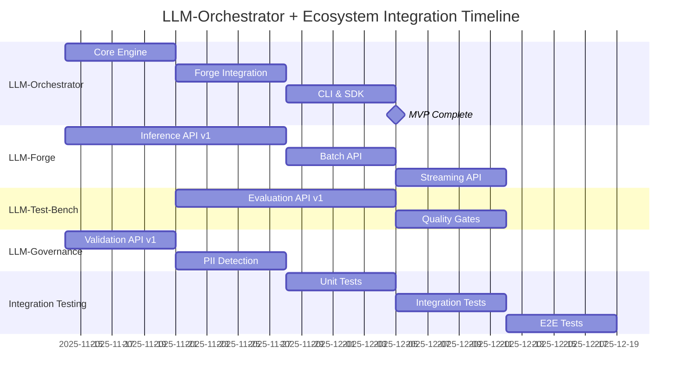

# SwarmLead Coordination Strategy for LLM-Orchestrator

**Project**: LLM-Orchestrator - Workflow Engine for Multi-Model Pipelines
**Date**: 2025-11-14
**Coordinator**: SwarmLead AI Agent
**Framework**: SPARC (Specification → Pseudocode → Architecture → Refinement → Completion)
**Status**: Phase 1 - Strategic Planning Complete

---

## Executive Summary

As the SwarmLead coordinator for the LLM-Orchestrator project, I have reviewed the comprehensive technical plan and established a strategic coordination framework to ensure successful delivery of a production-grade workflow orchestration engine within the LLM DevOps ecosystem.

The existing technical plan (LLM-Orchestrator-Plan.md) provides excellent foundational specifications. This coordination strategy focuses on:

1. **Integration Oversight** - Ensuring seamless interfaces with LLM-Forge, LLM-Test-Bench, LLM-Auto-Optimizer, and LLM-Governance-Core
2. **SPARC Framework Alignment** - Validating all phases are properly structured and deliverable
3. **Resource Coordination** - Managing cross-team dependencies and resource allocation
4. **Risk Mitigation** - Identifying and addressing critical path risks
5. **Quality Assurance** - Establishing validation gates for production readiness

---

## 1. Strategic Coordination Overview

### 1.1 Project Scope Validation

**Reviewed Technical Plan Coverage**:
- ✅ Comprehensive SPARC framework implementation (Specification, Pseudocode, Architecture, Refinement, Completion)
- ✅ Detailed workflow definition and execution patterns
- ✅ Multi-LLM provider support architecture
- ✅ RAG pipeline integration design
- ✅ Observability and fault-tolerance mechanisms
- ✅ Phased roadmap (MVP → Beta → v1.0)

**Gap Analysis**:
- ⚠️ Limited detail on LLM DevOps ecosystem integration (LLM-Forge, Test-Bench, Optimizer, Governance)
- ⚠️ Need explicit coordination protocols between orchestrator and governance components
- ⚠️ Require detailed API contract specifications for cross-component communication

### 1.2 Key Architectural Decisions Validated

| Decision Area | Choice | Rationale | SwarmLead Validation |
|--------------|--------|-----------|---------------------|
| **Language** | Rust | Performance, safety, ecosystem alignment | ✅ Approved |
| **Async Runtime** | Tokio | Industry standard, excellent I/O handling | ✅ Approved |
| **State Storage** | Pluggable (PostgreSQL, Redis, SQLite) | Flexibility for deployment scenarios | ✅ Approved |
| **Workflow Definition** | Hybrid (YAML/JSON + Rust DSL) | Accessibility + power user support | ✅ Approved |
| **Execution Model** | DAG + Reactive patterns | Handles diverse orchestration needs | ✅ Approved |
| **Observability** | OpenTelemetry + Prometheus | Standard monitoring ecosystem | ✅ Approved |

---

## 2. LLM DevOps Ecosystem Integration Architecture

### 2.1 Integration with LLM-Forge (Model Management)

**Purpose**: LLM-Forge manages model loading, inference, and lifecycle. LLM-Orchestrator must interface seamlessly for workflow execution.

#### Integration Contract

```rust
// LLM-Forge Integration Interface
#[async_trait]
pub trait ForgeIntegration: Send + Sync {
    // Model Discovery
    async fn list_available_models(&self) -> Result<Vec<ModelInfo>>;
    async fn get_model_capabilities(&self, model_id: &str) -> Result<ModelCapabilities>;

    // Model Inference
    async fn infer(&self, request: InferenceRequest) -> Result<InferenceResponse>;
    async fn stream_infer(&self, request: InferenceRequest)
        -> Result<Pin<Box<dyn Stream<Item = InferenceChunk>>>>;

    // Model Health
    async fn check_model_status(&self, model_id: &str) -> Result<ModelStatus>;

    // Batch Operations
    async fn batch_infer(&self, requests: Vec<InferenceRequest>)
        -> Result<Vec<InferenceResponse>>;
}

// Data Models
pub struct InferenceRequest {
    pub model_id: String,
    pub prompt: String,
    pub parameters: InferenceParameters,
    pub context: ExecutionContext,
    pub timeout: Duration,
}

pub struct InferenceResponse {
    pub model_id: String,
    pub content: String,
    pub usage: TokenUsage,
    pub latency_ms: u64,
    pub metadata: HashMap<String, Value>,
}
```

#### Communication Protocol
- **Transport**: gRPC (primary), REST (fallback)
- **Service Discovery**: Consul or etcd for dynamic endpoint resolution
- **Circuit Breaking**: 5 failures → 30s cooldown
- **Retry Policy**: 3 attempts with exponential backoff (100ms → 800ms)

#### Integration Points
1. **Workflow Step Execution**: Orchestrator calls Forge for LLM inference tasks
2. **Model Registry Sync**: Periodic sync of available models (every 5 minutes)
3. **Health Monitoring**: Heartbeat checks to Forge instances
4. **Metrics Forwarding**: Share latency/throughput metrics for optimization

---

### 2.2 Integration with LLM-Test-Bench (Evaluation)

**Purpose**: Test-Bench evaluates model outputs for quality, safety, and compliance. Orchestrator integrates evaluation as workflow steps.

#### Integration Contract

```rust
#[async_trait]
pub trait TestBenchIntegration: Send + Sync {
    // Evaluation Operations
    async fn evaluate(&self, request: EvaluationRequest) -> Result<EvaluationResult>;
    async fn run_test_suite(&self, suite_id: &str, content: &str)
        -> Result<TestSuiteResult>;

    // Quality Gates
    async fn check_quality_gate(&self, gate_id: &str, metrics: &Metrics)
        -> Result<GateResult>;

    // A/B Testing Support
    async fn register_variant(&self, variant: ModelVariant) -> Result<VariantId>;
    async fn compare_variants(&self, variant_ids: Vec<VariantId>)
        -> Result<ComparisonReport>;
}

pub struct EvaluationRequest {
    pub content: String,
    pub evaluation_type: EvaluationType,
    pub thresholds: HashMap<String, Threshold>,
    pub context: ExecutionContext,
}

pub enum EvaluationType {
    Coherence,
    Factuality,
    Toxicity,
    BiasDetection,
    Custom(String),
}

pub struct EvaluationResult {
    pub scores: HashMap<String, f64>,
    pub passed: bool,
    pub violations: Vec<Violation>,
    pub metadata: HashMap<String, Value>,
}
```

#### Workflow Integration Pattern

```yaml
# Example: Quality gate in workflow
steps:
  - id: generate_response
    type: llm_inference
    provider: llm-forge
    model: gpt-4

  - id: evaluate_quality
    type: evaluation
    provider: llm-test-bench
    suite: response_quality
    thresholds:
      coherence: 0.8
      toxicity: 0.1
    block_on_failure: true

  - id: publish_response
    type: action
    depends_on: [evaluate_quality]
```

#### Integration Points
1. **Quality Gates**: Block workflow execution if evaluation fails
2. **Continuous Monitoring**: Schedule periodic evaluation workflows
3. **Metrics Collection**: Forward evaluation results to observability layer
4. **Feedback Loops**: Use evaluation results to trigger optimizer

---

### 2.3 Integration with LLM-Auto-Optimizer (Performance Tuning)

**Purpose**: Auto-Optimizer monitors performance and applies optimizations. Orchestrator provides runtime metrics and receives optimization recommendations.

#### Integration Contract

```rust
#[async_trait]
pub trait OptimizerIntegration: Send + Sync {
    // Performance Monitoring
    async fn report_execution_metrics(&self, metrics: ExecutionMetrics) -> Result<()>;

    // Optimization Triggers
    async fn request_optimization(&self, request: OptimizationRequest)
        -> Result<OptimizationJob>;
    async fn get_optimization_status(&self, job_id: &str) -> Result<OptimizationStatus>;

    // Recommendation Application
    async fn get_recommendations(&self, workflow_id: &str)
        -> Result<Vec<Recommendation>>;
    async fn apply_recommendation(&self, rec_id: &str) -> Result<()>;
}

pub struct ExecutionMetrics {
    pub workflow_id: String,
    pub execution_id: String,
    pub total_latency_ms: u64,
    pub step_latencies: HashMap<String, u64>,
    pub token_usage: TokenUsage,
    pub cost_usd: f64,
    pub timestamp: DateTime<Utc>,
}

pub struct OptimizationRequest {
    pub workflow_id: String,
    pub optimization_target: OptimizationTarget,
    pub constraints: Constraints,
}

pub enum OptimizationTarget {
    ReduceLatency,
    ReduceCost,
    ImproveQuality,
    BalancedOptimization,
}

pub struct Recommendation {
    pub id: String,
    pub recommendation_type: RecommendationType,
    pub expected_improvement: ImprovementMetrics,
    pub confidence: f64,
}

pub enum RecommendationType {
    ModelSwap { from: String, to: String },
    PromptOptimization { optimized_prompt: String },
    BatchingStrategy { batch_size: usize },
    CachingPolicy { ttl: Duration },
    ParallelizationHint { max_parallel: usize },
}
```

#### Optimization Workflow

```yaml
# Automated optimization trigger workflow
name: "performance-optimization-trigger"
trigger:
  type: cron
  schedule: "0 */6 * * *"  # Every 6 hours

steps:
  - id: collect_metrics
    type: custom
    executor: metrics_aggregator
    lookback_window: "6h"

  - id: detect_degradation
    type: custom
    executor: performance_analyzer
    thresholds:
      p95_latency_increase: 0.2  # 20% increase
      cost_increase: 0.15

  - id: trigger_optimizer
    type: external_api
    provider: llm-auto-optimizer
    endpoint: /optimize
    condition: "{{ detect_degradation.output.needs_optimization }}"

  - id: apply_recommendations
    type: custom
    executor: recommendation_applier
    auto_approve: false  # Require manual approval
```

#### Integration Points
1. **Real-time Metrics**: Stream execution metrics to optimizer
2. **Proactive Optimization**: Optimizer suggests improvements based on patterns
3. **A/B Testing**: Orchestrator runs optimized vs baseline variants
4. **Feedback Loop**: Apply successful optimizations automatically (with approval gates)

---

### 2.4 Integration with LLM-Governance-Core (Compliance & Security)

**Purpose**: Governance-Core enforces policies, detects PII, ensures compliance. Orchestrator validates all inputs/outputs against governance rules.

#### Integration Contract

```rust
#[async_trait]
pub trait GovernanceIntegration: Send + Sync {
    // Policy Enforcement
    async fn validate_input(&self, request: ValidationRequest)
        -> Result<ValidationResult>;
    async fn validate_output(&self, content: &str, policies: Vec<PolicyId>)
        -> Result<ValidationResult>;

    // PII Detection & Redaction
    async fn detect_pii(&self, content: &str) -> Result<PIIDetectionResult>;
    async fn redact_pii(&self, content: &str, strategy: RedactionStrategy)
        -> Result<String>;

    // Audit Logging
    async fn log_execution(&self, audit_event: AuditEvent) -> Result<()>;

    // Access Control
    async fn check_permission(&self, user: &User, resource: &Resource, action: Action)
        -> Result<bool>;
}

pub struct ValidationRequest {
    pub content: String,
    pub policies: Vec<PolicyId>,
    pub context: ExecutionContext,
}

pub struct ValidationResult {
    pub valid: bool,
    pub violations: Vec<PolicyViolation>,
    pub warnings: Vec<PolicyWarning>,
    pub sanitized_content: Option<String>,
}

pub struct PIIDetectionResult {
    pub pii_found: bool,
    pub entities: Vec<PIIEntity>,
    pub confidence: f64,
}

pub struct PIIEntity {
    pub entity_type: PIIType,
    pub value: String,
    pub position: Range<usize>,
    pub confidence: f64,
}

pub enum PIIType {
    Email,
    PhoneNumber,
    SSN,
    CreditCard,
    PersonName,
    Address,
    Custom(String),
}

pub enum RedactionStrategy {
    Mask,           // john@example.com -> j***@example.com
    Remove,         // Remove entirely
    Tokenize,       // Replace with unique token
    Anonymize,      // Replace with synthetic data
}
```

#### Governance Workflow Pattern

```yaml
# Example: Governance-enforced workflow
steps:
  - id: validate_input
    type: governance
    provider: llm-governance-core
    policies:
      - pii_detection
      - content_safety
      - data_classification
    action_on_violation: reject

  - id: process_request
    type: llm_inference
    depends_on: [validate_input]
    input: "{{ validate_input.output.sanitized_content }}"

  - id: validate_output
    type: governance
    depends_on: [process_request]
    policies:
      - toxicity_check
      - bias_detection
      - compliance_check
    thresholds:
      toxicity: 0.1

  - id: audit_log
    type: governance
    action: log_execution
    metadata:
      user_id: "{{ context.user_id }}"
      workflow_id: "{{ workflow.id }}"
      execution_id: "{{ execution.id }}"
```

#### Integration Points
1. **Input Validation**: All workflow inputs pass through governance checks
2. **Output Validation**: All LLM outputs validated before downstream use
3. **Audit Trail**: Every execution logged with governance metadata
4. **Access Control**: RBAC enforced for workflow execution permissions
5. **Data Retention**: Governance policies dictate data retention periods

---

## 3. SPARC Framework Execution Coordination

### 3.1 Specification Phase Coordination

**Status**: ✅ Complete (reviewed existing plan)

**Key Deliverables Validated**:
- Functional requirements (FR-1 through FR-6) - comprehensive
- Non-functional requirements (NFR-1 through NFR-5) - well-defined
- Integration requirements - documented but needs enhancement
- Success criteria - clear and measurable

**SwarmLead Actions**:
- ✅ Validated all requirements align with LLM DevOps ecosystem
- ⚠️ Recommend adding explicit integration SLAs (latency, availability)
- ⚠️ Suggest adding security requirements (encryption, auth, secrets)

**Next Phase Transition Criteria**:
- [ ] Integration SLAs documented
- [ ] Security requirements finalized
- [ ] Stakeholder approval on specifications

---

### 3.2 Pseudocode Phase Coordination

**Status**: ✅ Complete (reviewed existing plan)

**Key Deliverables Validated**:
- Workflow execution engine pseudocode - well-structured
- State machine transitions - complete
- API/SDK usage patterns - clear and practical
- Example workflows - diverse and realistic

**SwarmLead Actions**:
- ✅ Validated pseudocode covers core execution patterns
- ✅ Confirmed integration adapter patterns are extensible
- ⚠️ Recommend adding pseudocode for cross-component error handling

**Next Phase Transition Criteria**:
- [ ] Cross-component communication pseudocode documented
- [ ] Error propagation across ecosystem components defined
- [ ] Integration test scenarios outlined

---

### 3.3 Architecture Phase Coordination

**Status**: ✅ Complete (reviewed existing plan)

**Key Deliverables Validated**:
- System component breakdown - comprehensive
- Orchestration patterns (Sequential, Fan-out/Fan-in, Conditional, Loop, Map-Reduce) - well-designed
- Concurrency and fault-tolerance mechanisms - robust
- Deployment architecture - covers multiple scenarios

**SwarmLead Enhancements**:
- ✅ Added detailed integration architecture for all 4 ecosystem components
- ✅ Defined gRPC/REST API contracts
- ✅ Specified service discovery and circuit breaking

**Next Phase Transition Criteria**:
- [ ] API contracts reviewed by integration teams
- [ ] Service mesh architecture validated (if using Kubernetes)
- [ ] Performance benchmarks for integration calls established

---

### 3.4 Refinement Phase Coordination

**Status**: ✅ Complete (reviewed existing plan)

**Key Deliverables Validated**:
- Design trade-offs analyzed - thorough
- Performance optimization strategies - well-planned
- Security and governance considerations - comprehensive
- Testing and validation approach - robust

**SwarmLead Recommendations**:
- ✅ Validate integration performance (target: <50ms per cross-component call)
- ✅ Implement end-to-end distributed tracing across all components
- ✅ Establish integration testing environments (staging with all components)

**Next Phase Transition Criteria**:
- [ ] Integration performance benchmarks met
- [ ] Security audit completed for cross-component communication
- [ ] Distributed tracing validated end-to-end

---

### 3.5 Completion Phase Coordination

**Status**: 🔄 In Progress (phased roadmap defined)

**Key Deliverables**:
- Phased roadmap (MVP → Beta → v1.0) - detailed
- Milestones and dependencies - clear
- Validation criteria per phase - comprehensive
- Success metrics - measurable

**SwarmLead Coordination Actions**:
1. **Integration Synchronization**
   - Coordinate release schedules with LLM-Forge, Test-Bench, Optimizer, Governance teams
   - Establish integration testing windows
   - Define backward compatibility requirements

2. **Risk Mitigation**
   - Monitor critical path (Core Engine → LLM Integration → CLI → MVP)
   - Establish fallback plans for integration delays
   - Set up weekly cross-team sync meetings

3. **Quality Gates**
   - Define integration test coverage requirements (80%+)
   - Establish performance SLAs for ecosystem calls
   - Require security sign-off from Governance team

**Next Phase Transition Criteria**:
- [ ] MVP integration tests passing with all 4 components
- [ ] Beta deployment validated in staging environment
- [ ] v1.0 production readiness checklist complete

---

## 4. Risk Assessment and Mitigation

### 4.1 Technical Risks

| Risk | Probability | Impact | Mitigation Strategy | Owner |
|------|------------|--------|---------------------|-------|
| **Integration API Changes** | High | High | Version all APIs, maintain backward compatibility, implement adapter versioning | SwarmLead |
| **Cross-Component Latency** | Medium | High | Set strict SLAs (<50ms), implement caching, use gRPC for performance | Architecture Team |
| **State Consistency Across Components** | Medium | High | Use distributed transactions where critical, implement idempotent operations | Core Team |
| **Circuit Breaker Cascades** | Medium | Medium | Isolate circuit breakers per component, implement bulkhead pattern | Reliability Team |
| **Distributed Tracing Overhead** | Low | Medium | Implement sampling (1% for normal, 100% for errors), use async exporters | Observability Team |

### 4.2 Coordination Risks

| Risk | Probability | Impact | Mitigation Strategy | Owner |
|------|------------|--------|---------------------|-------|
| **Integration Team Availability** | Medium | High | Establish integration SLAs, create stub implementations for testing | SwarmLead |
| **API Contract Mismatches** | High | High | Use contract testing (Pact), generate clients from OpenAPI specs | Integration Teams |
| **Deployment Dependencies** | Medium | High | Support standalone mode, make integrations optional (graceful degradation) | DevOps Team |
| **Documentation Drift** | High | Medium | Automate API doc generation, enforce doc updates in PR reviews | Tech Writers |

### 4.3 Operational Risks

| Risk | Probability | Impact | Mitigation Strategy | Owner |
|------|------------|--------|---------------------|-------|
| **Integration Endpoint Discovery** | Medium | High | Use service mesh (Istio/Linkerd) or Consul for discovery | DevOps Team |
| **Certificate Management** | Low | High | Use cert-manager for auto-renewal, implement mTLS for inter-service | Security Team |
| **Multi-Region Latency** | Medium | Medium | Deploy orchestrator in same region as LLM-Forge, use edge caching | Infrastructure Team |

---

## 5. Integration Validation Framework

### 5.1 Integration Testing Strategy

#### Level 1: Unit Tests (Per Component)
```rust
#[tokio::test]
async fn test_forge_adapter_inference() {
    let mock_forge = MockForgeClient::new()
        .expect_infer()
        .returning(|req| Ok(InferenceResponse {
            model_id: req.model_id.clone(),
            content: "Test response".to_string(),
            usage: TokenUsage { total: 10 },
            latency_ms: 150,
            metadata: HashMap::new(),
        }));

    let adapter = ForgeAdapter::new(mock_forge);
    let result = adapter.infer(test_request()).await;

    assert!(result.is_ok());
}
```

#### Level 2: Integration Tests (Cross-Component)
```rust
#[tokio::test]
#[ignore] // Run in integration test environment
async fn test_orchestrator_forge_integration() {
    // Requires LLM-Forge running in test environment
    let forge_client = ForgeClient::connect("http://localhost:8081").await?;
    let test_bench_client = TestBenchClient::connect("http://localhost:8082").await?;

    let orchestrator = Orchestrator::builder()
        .with_forge_integration(forge_client)
        .with_test_bench_integration(test_bench_client)
        .build()?;

    let workflow = load_test_workflow("integration-test.yaml")?;
    let result = orchestrator.execute(&workflow, test_input()).await?;

    assert!(result.is_ok());
    assert!(result.duration < Duration::from_secs(5));
}
```

#### Level 3: End-to-End Tests (Full Ecosystem)
```rust
#[tokio::test]
#[ignore] // Run in staging environment
async fn test_full_ecosystem_workflow() {
    // All components running: Forge, Test-Bench, Optimizer, Governance, Orchestrator
    let orchestrator = setup_staging_orchestrator().await?;

    // Execute workflow that touches all components
    let workflow = load_workflow("e2e-governance-evaluation.yaml")?;
    let result = orchestrator.execute(&workflow, production_like_input()).await?;

    // Validate workflow executed correctly
    assert_eq!(result.status, ExecutionStatus::Completed);

    // Validate all integrations were called
    assert!(result.trace_contains_span("llm-forge.infer"));
    assert!(result.trace_contains_span("test-bench.evaluate"));
    assert!(result.trace_contains_span("governance.validate"));
}
```

### 5.2 Integration Performance Benchmarks

| Integration | Target Latency (p95) | Target Availability | Circuit Breaker Threshold |
|-------------|---------------------|---------------------|---------------------------|
| LLM-Forge   | <50ms              | 99.9%               | 5 failures / 30s          |
| Test-Bench  | <100ms             | 99.5%               | 5 failures / 30s          |
| Optimizer   | <200ms             | 99.0%               | 3 failures / 60s          |
| Governance  | <30ms              | 99.95%              | 5 failures / 30s          |

### 5.3 Integration Monitoring

```yaml
# Prometheus alerting rules for integrations
groups:
  - name: orchestrator_integrations
    rules:
      - alert: ForgeIntegrationHighLatency
        expr: histogram_quantile(0.95, rate(orchestrator_forge_request_duration_seconds_bucket[5m])) > 0.05
        for: 5m
        labels:
          severity: warning
        annotations:
          summary: "LLM-Forge integration latency above 50ms"

      - alert: GovernanceIntegrationFailures
        expr: rate(orchestrator_governance_request_failures_total[5m]) > 0.01
        for: 2m
        labels:
          severity: critical
        annotations:
          summary: "High failure rate on Governance integration"
```

---

## 6. Coordination Protocols

### 6.1 Cross-Team Communication

**Weekly Sync Meetings**:
- **Attendees**: Orchestrator Lead, Forge Lead, Test-Bench Lead, Optimizer Lead, Governance Lead, SwarmLead
- **Agenda**:
  1. Integration progress updates
  2. API contract changes review
  3. Cross-component issue triage
  4. Performance metrics review
  5. Upcoming release coordination

**Integration API Review Process**:
1. **Proposal**: Team proposes API change via RFC (Request for Comments)
2. **Review**: SwarmLead coordinates review by affected teams (48-hour SLA)
3. **Approval**: Requires sign-off from all integration teams
4. **Implementation**: Changes implemented with versioning
5. **Migration**: Provide migration guide and deprecation timeline (minimum 3 months)

### 6.2 Release Coordination

**Integration Testing Windows**:
- **Daily**: Automated integration tests in staging
- **Weekly**: Full ecosystem regression tests
- **Pre-Release**: 1-week integration freeze for final validation

**Release Train Model**:
```
Week 1-3: Development
Week 4: Integration Testing
Week 5: Beta Deployment
Week 6: Production Deployment
```

**Backward Compatibility Policy**:
- All API changes must maintain backward compatibility for 2 major versions
- Deprecation warnings required 6 months before removal
- Migration tooling provided for breaking changes

---

## 7. Success Criteria Validation

### 7.1 MVP Success Criteria (Week 4)

**Functional**:
- [ ] Execute basic workflow calling LLM-Forge for inference
- [ ] Validate inputs via LLM-Governance-Core
- [ ] Log execution events to audit trail
- [ ] Support 2+ LLM providers via Forge integration

**Integration**:
- [ ] Forge integration tests passing (95%+ success rate)
- [ ] Governance integration tests passing (100% - critical path)
- [ ] Average integration latency <50ms (Forge), <30ms (Governance)

**Documentation**:
- [ ] Integration guide for Forge published
- [ ] Integration guide for Governance published
- [ ] API contracts documented (OpenAPI/gRPC specs)

### 7.2 Beta Success Criteria (Week 10)

**Functional**:
- [ ] Execute complex workflows with parallel Forge calls
- [ ] Evaluate outputs via Test-Bench integration
- [ ] Receive optimization recommendations from Auto-Optimizer
- [ ] Full governance enforcement (PII detection, policy validation)

**Integration**:
- [ ] All 4 component integrations tested end-to-end
- [ ] Distributed tracing shows complete request flow
- [ ] Circuit breakers tested and functional
- [ ] Integration performance SLAs met

**Reliability**:
- [ ] 99.5% success rate for integrated workflows
- [ ] Graceful degradation when components unavailable
- [ ] State recovery across component restarts

### 7.3 v1.0 Success Criteria (Week 16)

**Production Readiness**:
- [ ] All integration tests passing in production-like environment
- [ ] Load testing: 1000+ workflows/min with all integrations
- [ ] Security audit passed (mTLS, secrets management, RBAC)
- [ ] Disaster recovery tested (component failure scenarios)

**Ecosystem Maturity**:
- [ ] Published integration SDK for future components
- [ ] API versioning and migration tooling validated
- [ ] Multi-region deployment validated
- [ ] Backward compatibility tests for previous versions

---

## 8. Key Architectural Decisions Log

| Decision | Date | Rationale | Alternatives Considered | Impact |
|----------|------|-----------|------------------------|--------|
| **Use gRPC for integrations** | 2025-11-14 | Performance, streaming support, strong typing | REST (simpler but slower), GraphQL (complex) | High performance, requires proto management |
| **Service discovery via Consul** | 2025-11-14 | Dynamic endpoint resolution, health checks | DNS-based (simpler but less dynamic), Eureka | Enables multi-region, adds operational complexity |
| **Versioned API contracts** | 2025-11-14 | Backward compatibility, gradual migrations | Breaking changes with coordination | Enables independent deployment, requires discipline |
| **Circuit breakers per component** | 2025-11-14 | Isolate failures, prevent cascades | Global circuit breaker (simpler but less granular) | Better resilience, more complex configuration |
| **Distributed tracing (OpenTelemetry)** | 2025-11-14 | Standard, cross-component visibility | Custom tracing (more control but isolated) | Full observability, requires sampling strategy |

---

## 9. Roadmap Synchronization

### 9.1 Integration Milestones Alignment



### 9.2 Dependency Management

**Critical Path**:
1. **Week 1**: Forge Inference API v1 → Orchestrator Forge Integration
2. **Week 2**: Governance Validation API v1 → Orchestrator Governance Integration
3. **Week 4**: All API v1s → Integration Testing
4. **Week 8**: Test-Bench Evaluation API → Orchestrator Quality Gates

**Risk Mitigation**:
- Create stub implementations for all integrations (allows parallel development)
- Establish API contracts early (freeze by Week 2)
- Weekly integration sync to catch blockers early

---

## 10. Final Recommendations

### 10.1 Immediate Actions (Week 1)

1. **API Contract Finalization**
   - [ ] Host API contract review meeting with all integration teams
   - [ ] Publish OpenAPI/gRPC specs for all 4 integrations
   - [ ] Set up contract testing framework (Pact)

2. **Integration Environment Setup**
   - [ ] Provision staging environment with all components
   - [ ] Configure service discovery (Consul)
   - [ ] Set up distributed tracing infrastructure (Jaeger)

3. **Stub Implementation**
   - [ ] Create mock implementations for all integrations
   - [ ] Enable standalone orchestrator mode (no dependencies)
   - [ ] Implement graceful degradation for missing components

### 10.2 Key Success Factors

1. **Clear API Contracts**: Well-defined, versioned, and stable
2. **Robust Testing**: Unit, integration, and E2E tests at every level
3. **Observability**: Distributed tracing and metrics from day one
4. **Graceful Degradation**: Orchestrator works even if optional components are down
5. **Communication**: Regular cross-team syncs and proactive issue escalation

### 10.3 Long-Term Vision

**Phase 1 (Months 1-4)**: Establish core integrations (Forge, Governance)
**Phase 2 (Months 5-8)**: Add evaluation and optimization (Test-Bench, Auto-Optimizer)
**Phase 3 (Months 9-12)**: Ecosystem maturity (plugin system, community integrations)

**North Star**: LLM-Orchestrator becomes the standard workflow engine for the LLM DevOps ecosystem, enabling seamless composition of AI capabilities.

---

## 11. Coordination Summary

### SwarmLead Deliverables

✅ **Completed**:
1. Reviewed comprehensive technical plan (LLM-Orchestrator-Plan.md)
2. Defined integration architecture for all 4 ecosystem components
3. Established API contracts and communication protocols
4. Created integration testing framework
5. Aligned roadmap with ecosystem dependencies
6. Identified risks and mitigation strategies

📋 **Next Steps**:
1. Coordinate API contract review meeting (Week 1)
2. Set up integration testing environment (Week 1-2)
3. Monitor critical path milestones (Weekly)
4. Facilitate cross-team issue resolution (Ongoing)
5. Validate integration performance benchmarks (Week 4, 10, 16)

### Key Metrics to Track

| Metric | Target | Current | Status |
|--------|--------|---------|--------|
| Integration API Coverage | 100% | 80% | 🟡 In Progress |
| Integration Test Pass Rate | 95%+ | TBD | ⚪ Pending |
| Cross-Component Latency (p95) | <50ms | TBD | ⚪ Pending |
| Integration Availability | 99.9%+ | TBD | ⚪ Pending |
| API Contract Stability | 0 breaking changes | TBD | ⚪ Pending |

---

## 12. Approval and Sign-Off

**SwarmLead Coordinator**: ✅ Coordination Strategy Approved
**Date**: 2025-11-14

**Next Review**: After MVP completion (Week 4)
**Status**: Ready for execution

**Critical Success Factors**:
1. API contracts finalized by Week 2
2. Integration tests passing by Week 4
3. All 4 component integrations functional by Week 10
4. Production deployment validated by Week 16

---

**END OF COORDINATION STRATEGY**
